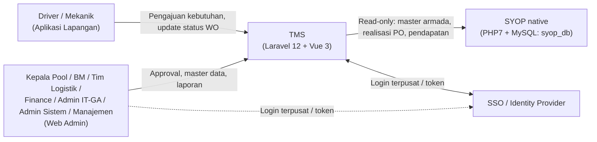
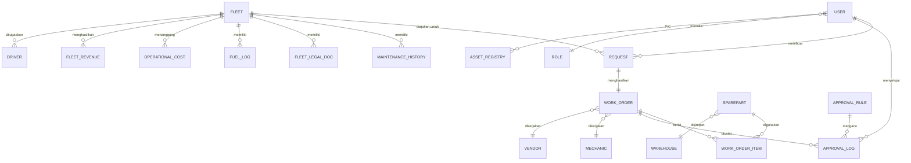
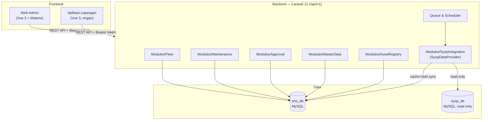
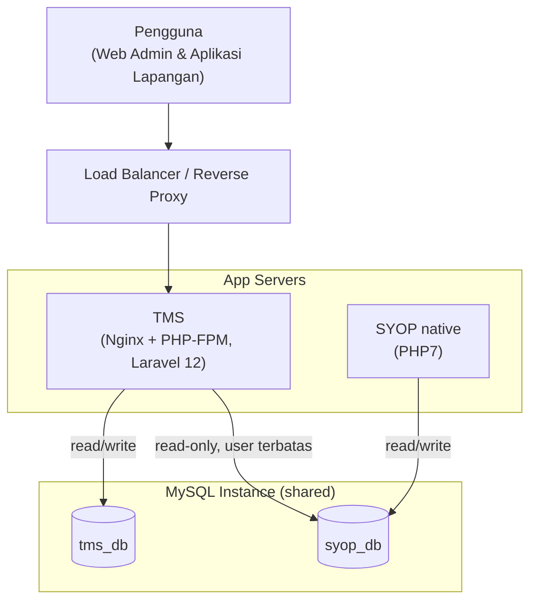

# Architecture Document — TMS v1.0

## 1. Pendahuluan

### 1.1 Tujuan Dokumen

Dokumen ini menjabarkan arsitektur teknis Transport Management System (TMS) sebagai turunan teknis dari [PRD TMS v1.1](01-PRD.md). Cakupannya meliputi arsitektur frontend, backend, data, integrasi dengan sistem SYOP native, keamanan, dan deployment — sebagai acuan bagi tim development dalam membangun sistem.

### 1.2 Ruang Lingkup

Arsitektur ini mencakup seluruh modul TMS sebagaimana didefinisikan pada PRD: Pengajuan, Work Order/SPK, Monitoring & Approval, Master Data, Riwayat & Analisis Armada, Integrasi SYOP, dan Asset Registry (IT & GA).

### 1.3 Keputusan Teknis yang Menjadi Dasar

- Frontend web admin: Vue 3 + Materio (Vuetify) — konsisten dengan template SYOP v4.
- Backend: Laravel 12 (REST API).
- Database: MySQL — mengikuti kondisi SYOP native saat ini, bukan menunggu migrasi ke SYOP v4 (PostgreSQL).
- Integrasi ke SYOP native dilakukan melalui lapisan adapter agar dapat diganti saat SYOP bermigrasi ke SYOP v4.

## 2. Gambaran Arsitektur

### 2.1 Ringkasan Tech Stack

| Layer | Teknologi | Keterangan |
|---|---|---|
| Frontend — Web Admin | Vue.js 3, Vuetify (template Materio), Pinia, vue-router, axios | SPA untuk Tim Logistik, Kepala Pool, BM, Finance, Admin IT/GA, Admin Sistem, Manajemen. |
| Frontend — Aplikasi Lapangan | Vue.js 3 (bundle terpisah/lazy-loaded), UI ringan (non-Materio) | Untuk Driver/Mekanik; dioptimalkan untuk perangkat kelas bawah & koneksi tidak stabil (lihat Bagian 3.2). |
| Backend | Laravel 12 (PHP 8.2+), REST API | Struktur modular per domain (lihat Bagian 4.1). |
| Autentikasi | Laravel Sanctum/Passport, SSO/OAuth2 | Validasi token dari SSO provider bersama (lihat Bagian 7.1). |
| Database utama | MySQL 8.x — `tms_db` | Koneksi read/write default aplikasi Laravel TMS. |
| Database integrasi | MySQL 8.x — `syop_db` (existing, milik SYOP native) | Diakses read-only melalui koneksi database kedua, hanya lewat `SyopNativeAdapter`. |
| Queue & Scheduler | Laravel Queue + Scheduler | Sinkronisasi data SYOP berkala & notifikasi (lihat Bagian 4.5). |
| Penyimpanan Lampiran | Local disk / object storage (S3-compatible) | Foto pengajuan, dokumentasi WO, invoice, dokumen legalitas. |
| Web/App Server | Nginx + PHP-FPM | Menjalankan aplikasi Laravel di tiap lingkungan. |
| CI/CD | Pipeline build & deploy otomatis (lint, test, migrate, deploy) | Per lingkungan: Development, Staging, Production (lihat Bagian 8.3). |
| Observability | Laravel log → log aggregator, uptime/response time monitoring | Lihat Bagian 9.1. |

### 2.2 Diagram Konteks

Gambar 1. Context Diagram — TMS terhadap pengguna dan sistem SYOP native.

### 2.3 Prinsip Arsitektur

- Batas kepemilikan data jelas — TMS memiliki database sendiri (`tms_db`), terpisah dari `syop_db` meskipun berada pada instance MySQL yang sama.
- Semua akses ke data SYOP dibungkus lapisan adapter (`SyopDataProvider`), tidak ada query langsung tersebar di kode bisnis.
- Alur approval bersifat konfigurasi (data-driven), bukan hardcode, agar mudah menyesuaikan kebijakan ke depan.
- SSO disiapkan sejak awal agar pengguna lintas sistem tidak login berulang.
- Arsitektur disiapkan agar adapter dapat diganti tanpa mengubah logika bisnis inti saat SYOP bermigrasi ke SYOP v4.

## 3. Arsitektur Frontend

### 3.1 Web Admin (Vue 3 + Materio)

Digunakan oleh Tim Logistik, Kepala Pool, Branch Manager, Finance, dan Admin IT/GA. Dibangun sebagai Single Page Application dengan struktur:

- Routing: `vue-router`, dengan route guard berbasis role/permission.
- State management: Pinia.
- HTTP client: axios dengan interceptor untuk menyisipkan token dan menangani refresh token/401.
- Menu dan komponen dirender sesuai role pengguna (RBAC — lihat Bagian 7.2).
- Komponen UI (data table, form, dashboard) memakai komponen bawaan Materio agar konsisten dengan SYOP v4.

### 3.2 Form Pengajuan Lapangan (Driver/Mekanik)

Sesuai keputusan pada PRD Bagian 8.5, alur pengajuan dari lapangan menggunakan tampilan yang lebih ringan dibanding panel admin penuh — bundle terpisah/lazy-loaded, minim aset berat, dioptimalkan agar tetap responsif pada perangkat kelas bawah dan koneksi tidak stabil.

### 3.3 Autentikasi Frontend

Token OAuth2/JWT dari SSO disimpan pada memory/http-only cookie (bukan localStorage, untuk mengurangi risiko XSS). Pengguna yang belum terautentikasi diarahkan ke halaman SSO; setelah berhasil, frontend menerima token dan menyertakannya pada setiap pemanggilan API.

## 4. Arsitektur Backend

### 4.1 Struktur Modular Laravel 12

Backend disusun berbasis domain (bukan MVC generik satu folder besar), agar mudah dipetakan ke modul PRD dan mudah dipecah menjadi service terpisah di masa depan bila diperlukan:

- `Modules/Fleet` — master armada, legalitas, fuel log.
- `Modules/Maintenance` — pengajuan, Work Order/SPK, riwayat perbaikan.
- `Modules/Approval` — workflow verifikasi dan approval berjenjang.
- `Modules/MasterData` — driver, mekanik, bengkel/vendor, warehouse, sparepart.
- `Modules/AssetRegistry` — registrasi aset IT & GA.
- `Modules/SyopIntegration` — adapter dan service integrasi ke SYOP native.

### 4.2 API

REST API dengan versioning (`/api/v1`), response terstandarisasi menggunakan Laravel API Resource. Autentikasi API menggunakan Laravel Sanctum/Passport, tervalidasi terhadap token SSO.

### 4.3 Approval Workflow Engine

Alur verifikasi (Kepala Pool → BM → Tim Logistik → Finance) diimplementasikan sebagai state machine dengan status eksplisit (mis. `submitted`, `pool_verified`, `bm_verified`, `logistik_verified`, `finance_approved`, `rejected`, `completed`). Aturan approval (role mana yang wajib approve, ambang nominal untuk Finance) disimpan sebagai data konfigurasi (tabel `approval_rule`), bukan hardcode di kode program — sesuai kebutuhan FR-09 pada PRD.

### 4.4 Lapisan Adapter (SyopDataProvider)

Seluruh interaksi dengan data SYOP native diakses melalui satu interface, dengan implementasi konkret saat ini terhubung ke `syop_db`:

- Interface: `SyopDataProvider` — method antara lain `getMasterArmada()`, `getMasterDriver()`, `getRealisasiPO()`, `getPendapatan()`, `getDataPerjalanan()`.
- Implementasi saat ini: `SyopNativeAdapter` — mengakses `syop_db` (MySQL) melalui koneksi database read-only terpisah.
- Implementasi masa depan: `SyopV4Adapter` — memanggil API SYOP v4, diaktifkan lewat konfigurasi tanpa mengubah kode modul bisnis TMS (lihat Bagian 6.3).

### 4.5 Queue & Scheduler

Job terjadwal (Laravel Scheduler + Queue) digunakan untuk:

1. Sinkronisasi berkala data read-heavy dari `syop_db` — realisasi PO dan pendapatan — ke tabel lokal/cache di `tms_db` agar perhitungan profitabilitas tidak membebani `syop_db` pada setiap request.
2. Pengiriman notifikasi (approval tertunda, legalitas armada mendekati jatuh tempo).

## 5. Arsitektur Data

### 5.1 Entitas Utama — Database TMS (tms_db)

- `fleet` (armada), `driver`, `mechanic`, `vendor`/bengkel, `warehouse`, `sparepart`
- `request` (pengajuan), `work_order`/spk, `approval_log`, `approval_rule`
- `maintenance_history`, `fleet_legal_doc`, `fuel_log`, `operational_cost`, `fleet_revenue` (sinkron dari SYOP)
- `asset_registry` (IT & GA)
- `user`, `role`, `permission`

### 5.2 Diagram Relasi Data (ERD Ringkas)

Gambar 2. ERD ringkas entitas utama TMS. Skema lengkap (termasuk tabel fondasi/referensi seperti `branches`, `roles`, `permissions`) ada pada [05-DB-Schema.sql](05-DB-Schema.sql).

### 5.3 Hubungan dengan Database SYOP Native (syop_db)

`tms_db` dan `syop_db` direkomendasikan berada pada instance MySQL yang sama (bila infrastruktur memungkinkan) namun sebagai database terpisah — bukan digabung dalam satu database/schema. Aplikasi Laravel TMS mengonfigurasi dua koneksi database: koneksi default (read/write) ke `tms_db`, dan koneksi kedua (read-only, user MySQL dengan hak akses terbatas) ke `syop_db`. Akses ke koneksi kedua ini hanya boleh dilakukan melalui `SyopNativeAdapter` (Bagian 4.4), tidak melalui model Eloquent yang diakses bebas dari modul lain.

### 5.4 Strategi Migrasi & Sinkronisasi Data Awal

- Master armada dan driver: diimpor sekali dari `syop_db` ke `tms_db` saat go-live (one-time import script); setelahnya `tms_db` menjadi source of truth dan dikelola mandiri di TMS.
- Data transaksional (realisasi PO, pendapatan, data perjalanan): tetap dibaca dari `syop_db` secara berkala melalui adapter, tidak diduplikasi permanen — kecuali disimpan sementara di tabel cache lokal demi performa laporan (Bagian 4.5).

## 6. Arsitektur Integrasi

### 6.1 Diagram Komponen

Gambar 3. Component diagram — frontend, backend, dan data TMS.

### 6.2 Matriks Integrasi dengan SYOP

| Data | Arah | Mekanisme | Frekuensi | Source of Truth |
|---|---|---|---|---|
| Master Armada (fleet) | SYOP → TMS | One-time import script saat go-live | Sekali (go-live) | TMS (setelah go-live) |
| Master Driver | SYOP → TMS | One-time import script saat go-live | Sekali (go-live) | TMS (setelah go-live) |
| Master Transportir/Vendor | SYOP → TMS | One-time import script saat go-live (bila relevan) | Sekali (go-live) | TMS (setelah go-live) |
| Realisasi PO | SYOP → TMS | `SyopNativeAdapter.getRealisasiPO()`, scheduled job → cache `fleet_revenue` | Berkala (mis. harian) | SYOP |
| Pendapatan Armada | SYOP → TMS | `SyopNativeAdapter.getPendapatan()`, scheduled job | Berkala | SYOP |
| Data Perjalanan/Distribusi | SYOP → TMS | `SyopNativeAdapter.getDataPerjalanan()` | Berkala/on-demand | SYOP |
| Biaya Operasional (WO, fuel, manual) | Internal TMS | Dicatat langsung oleh modul TMS | Real-time | TMS |
| Identitas & Login Pengguna | SSO Provider ↔ TMS | OAuth2/Passport token exchange | Real-time (saat login) | SSO Provider |

Seluruh baris dengan arah "SYOP → TMS" wajib melalui lapisan `SyopDataProvider`/`SyopNativeAdapter` (Bagian 4.4) — tidak ada query langsung ke `syop_db` dari modul bisnis lain.

### 6.3 Rencana Adaptasi ke SYOP v4

Ketika SYOP v4 (Laravel/PostgreSQL) sudah live, integrasi dialihkan dengan mengganti implementasi adapter dari `SyopNativeAdapter` menjadi `SyopV4Adapter` (memanggil REST API SYOP v4, bukan lagi query MySQL langsung). Disarankan ada periode paralel run — kedua sumber data dibandingkan untuk validasi — sebelum `SyopNativeAdapter` dinonaktifkan sepenuhnya.

## 7. Keamanan

### 7.1 Autentikasi & SSO

Login terpusat melalui SSO/OAuth2 provider yang sama dengan SYOP v4, sehingga satu akun berlaku untuk kedua sistem.

### 7.2 Otorisasi (Role-Based Access Control)

Peran pada Bagian 4 PRD (Driver, Mekanik, Kepala Pool, BM, Tim Logistik, Finance, Admin IT/GA, Admin Sistem) dipetakan menjadi permission granular per modul (policy Laravel) — misalnya permission terpisah untuk membuat pengajuan, menerbitkan SPK, melakukan approval, dan mengelola master data.

### 7.3 Audit Trail

Seluruh aksi approval dan perubahan data yang berkaitan dengan biaya dicatat pada tabel audit log (pelaku, waktu, aksi, nilai sebelum/sesudah), sesuai kebutuhan Auditability pada PRD.

### 7.4 Proteksi Data

- Seluruh komunikasi menggunakan HTTPS.
- Koneksi ke `syop_db` menggunakan user MySQL terpisah dengan hak akses read-only dan least privilege (hanya tabel yang diperlukan).
- Kredensial database dan token SSO disimpan melalui environment variable/secret manager, tidak pernah di-hardcode dalam kode program.

## 8. Arsitektur Deployment

### 8.1 Diagram Deployment

Gambar 4. Topologi deployment — TMS berbagi instance MySQL dengan SYOP native.

Staging TMS terhubung ke *replika* `syop_db`, bukan ke `MySQLInstance` production di atas (lihat Bagian 8.2).

### 8.2 Lingkungan

Disiapkan tiga lingkungan: Development, Staging, dan Production. Staging TMS disarankan terhubung ke salinan/replika `syop_db` (bukan langsung ke production SYOP) agar pengujian integrasi tidak berisiko terhadap data operasional yang sedang berjalan.

### 8.3 CI/CD

Pipeline build dan deploy otomatis (lint, test, migrasi database, deploy) dijalankan per lingkungan. Migrasi `tms_db` dikelola melalui Laravel migration secara terpisah dari migrasi `syop_db`, yang tetap berada di bawah kendali sistem SYOP native.

## 9. Observability & Maintenance

### 9.1 Logging & Monitoring

Log aplikasi terpusat (Laravel log ke log aggregator) dan monitoring uptime/response time API, agar gangguan pada integrasi ke `syop_db` dapat terdeteksi lebih awal.

### 9.2 Backup & Disaster Recovery

Backup `tms_db` dijadwalkan terpisah dari backup `syop_db`. Target RPO (Recovery Point Objective) dan RTO (Recovery Time Objective) perlu disepakati bersama tim infrastruktur/DBA sebelum go-live.

## 10. Asumsi & Batasan Teknis

- Server aplikasi TMS memiliki akses jaringan ke instance MySQL yang sama dengan SYOP native, dengan kredensial read-only khusus — perlu dikonfirmasi bersama tim infrastruktur/DBA.
- Struktur tabel `syop_db` (native) diasumsikan relatif stabil dalam jangka pendek; bila berubah signifikan, hanya lapisan `SyopNativeAdapter` yang perlu disesuaikan.
- Jika SSO belum siap pada awal proyek, TMS dapat menggunakan mekanisme login sementara dengan rencana migrasi ke SSO begitu tersedia.
- Linimasa migrasi SYOP ke SYOP v4 belum pasti; arsitektur ini disusun agar adaptasi ke SYOP v4 tidak memerlukan perombakan besar (lihat Bagian 6.3).
