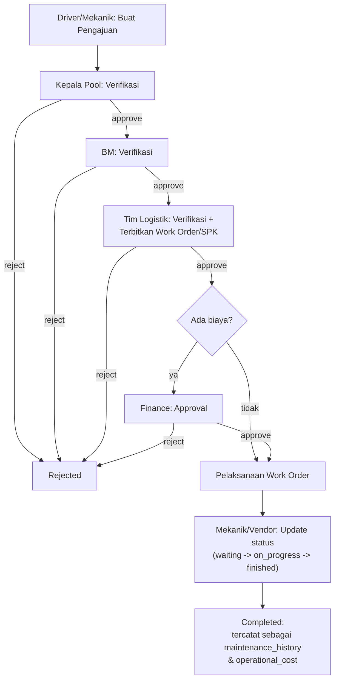
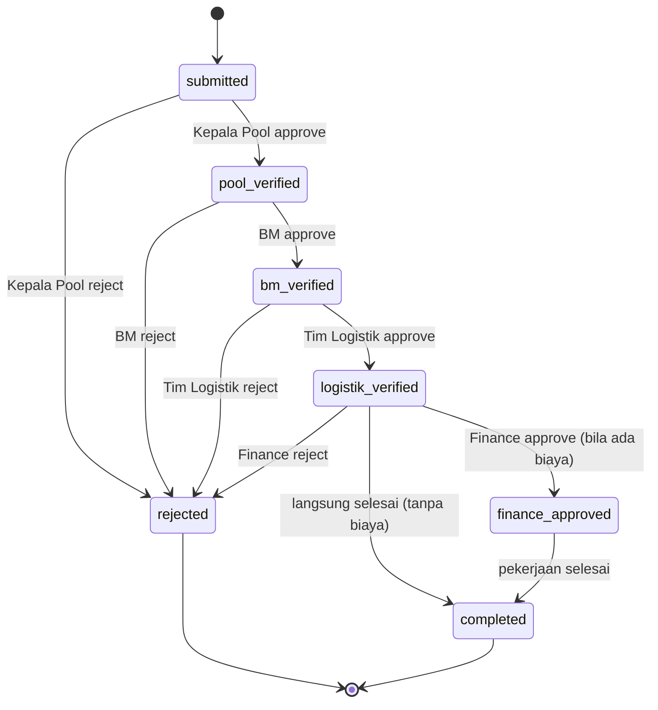
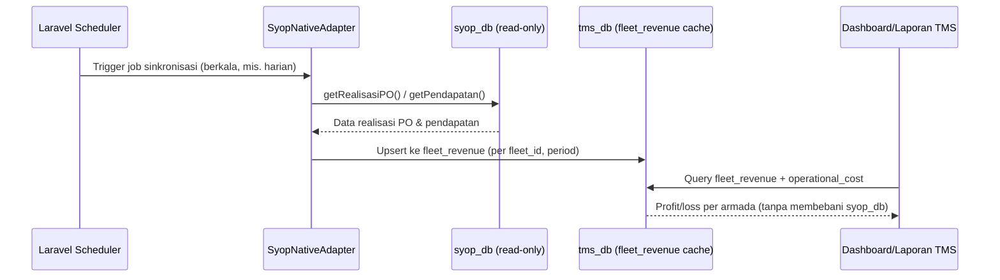

# Design Document — TMS v1.0

## 1. Pendahuluan

### 1.1 Tujuan Dokumen

Dokumen ini merinci desain teknis Transport Management System (TMS) sebagai turunan dari [Architecture Document TMS v1.0](02-Architecture.md) — mencakup desain skema basis data, spesifikasi API, alur proses (flow & state machine), dan desain antarmuka pengguna. Dokumen ini menjadi acuan langsung bagi tim development saat implementasi.

### 1.2 Ruang Lingkup

Cakupan mengikuti modul yang telah didefinisikan pada PRD dan Architecture Document: Pengajuan, Work Order/SPK, Approval, Master Data, Riwayat & Analisis Armada, Integrasi SYOP, dan Asset Registry (IT & GA).

## 2. Desain Basis Data (tms_db)

### 2.1 Konvensi Umum

- Primary key: `BIGINT UNSIGNED AUTO_INCREMENT` pada seluruh tabel, kecuali tabel pivot.
- Setiap tabel memiliki kolom `created_at` dan `updated_at` (timestamps).
- Tabel master (`fleets`, `drivers`, `mechanics`, `vendors`, `spareparts`, `users`) menggunakan soft delete (kolom `deleted_at`).
- Foreign key menggunakan penamaan `{tabel_singular}_id`, dengan constraint `ON DELETE RESTRICT` untuk data transaksional dan `ON DELETE SET NULL` untuk relasi opsional.
- Kolom status disimpan sebagai string/enum yang konsisten dengan state machine (Bagian 4.2), bukan angka tanpa makna.

### 2.2 Tabel Master Data

Lihat DDL lengkap pada [05-DB-Schema.sql](05-DB-Schema.sql), Bagian 2–3.

### 2.3 Tabel Transaksional

Lihat DDL lengkap pada [05-DB-Schema.sql](05-DB-Schema.sql), Bagian 4.

### 2.4 Tabel Riwayat & Analisis Armada

Lihat DDL lengkap pada [05-DB-Schema.sql](05-DB-Schema.sql), Bagian 5.

### 2.5 Tabel Pendukung

Lihat DDL lengkap pada [05-DB-Schema.sql](05-DB-Schema.sql), Bagian 6.

## 3. Desain API

### 3.1 Konvensi Umum

- Base URL: `/api/v1`
- Autentikasi: Bearer token (hasil pertukaran token SSO), dikirim pada header `Authorization`.
- Format response sukses: `{ "data": ..., "meta": ... }` — mengikuti Laravel API Resource.
- Format response error: `{ "message": ..., "errors": {...} }` dengan HTTP status code standar (400, 401, 403, 404, 422, 500).
- List endpoint mendukung pagination (`?page=&per_page=`) dan filter dasar (`?status=&fleet_id=&date_from=&date_to=`).

### 3.2 Endpoint — Master Data

Seluruh entitas master data memakai CRUD penuh (`GET` list, `POST` tambah, `GET/PUT/DELETE` per `{id}`) untuk konsistensi implementasi — draf awal dokumen ini hanya mencantumkan list/create untuk sebagian entitas, sudah disamakan di sini.

| Method | Endpoint | Deskripsi |
|---|---|---|
| GET/POST | `/branches` | Daftar / tambah cabang. |
| GET/PUT/DELETE | `/branches/{id}` | Detail / ubah / hapus cabang. |
| GET/POST | `/fleets` | Daftar / tambah armada. |
| GET/PUT/DELETE | `/fleets/{id}` | Detail / ubah / hapus (soft delete) armada. |
| GET/POST | `/drivers` | Daftar / tambah driver. |
| GET/PUT/DELETE | `/drivers/{id}` | Detail / ubah / hapus driver. |
| GET/POST | `/mechanics` | Daftar / tambah mekanik internal. |
| GET/PUT/DELETE | `/mechanics/{id}` | Detail / ubah / hapus mekanik. |
| GET/POST | `/vendors` | Daftar / tambah bengkel/vendor eksternal. |
| GET/PUT/DELETE | `/vendors/{id}` | Detail / ubah / hapus vendor. |
| GET/POST | `/warehouses` | Daftar / tambah gudang. |
| GET/PUT/DELETE | `/warehouses/{id}` | Detail / ubah / hapus gudang. |
| GET/POST | `/spareparts` | Daftar / tambah sparepart (termasuk `stock_qty`, `min_stock`; filter `below_minimum`). |
| GET/PUT/DELETE | `/spareparts/{id}` | Detail / ubah / hapus sparepart. |
| GET/POST | `/cost-types` | Daftar / tambah jenis biaya operasional. |
| GET/PUT/DELETE | `/cost-types/{id}` | Detail / ubah / hapus jenis biaya. |
| GET/POST | `/job-types` | Daftar / tambah jenis pekerjaan maintenance. |
| GET/PUT/DELETE | `/job-types/{id}` | Detail / ubah / hapus jenis pekerjaan. |

### 3.3 Endpoint — Pengajuan & Work Order/SPK

| Method | Endpoint | Deskripsi |
|---|---|---|
| GET | `/requests` | Daftar pengajuan (filter `status`, `fleet_id`, `type`, `date_from`, `date_to`). |
| POST | `/requests` | Buat pengajuan baru (lihat contoh payload Bagian 3.7). |
| GET | `/requests/{id}` | Detail satu pengajuan. |
| GET | `/requests/mine` | Daftar pengajuan milik pengguna yang login (FR-04). |
| POST | `/requests/{id}/attachments` | Unggah lampiran (foto/dokumen) untuk pengajuan. |
| GET | `/work-orders` | Daftar Work Order/SPK (filter `status`, `approval_status`, `fleet_id`). |
| POST | `/work-orders` | Menetapkan pelaksana (`request_id`, `execution_type`, `mechanic_id`/`vendor_id`) pada Work Order pendamping yang sudah otomatis dibuat sejak pengajuan disubmit — lihat catatan implementasi di bawah. |
| GET | `/work-orders/{id}` | Detail Work Order, termasuk item, lampiran, dan timeline approval. |
| PATCH | `/work-orders/{id}/status` | Ubah status pelaksanaan (`waiting` → `on_progress` → `finished`); hanya bisa keluar dari `waiting` setelah `approval_status` mencapai `finance_approved`/`completed`. |
| POST | `/work-orders/{id}/items` | Tambah rincian item/biaya (sparepart, jasa) pada Work Order. |
| POST | `/work-orders/{id}/attachments` | Unggah dokumentasi pekerjaan (foto, invoice). |

**Catatan implementasi — Request vs Work Order:** karena `approval_logs.work_order_id` bersifat `NOT NULL` (Bagian 4.6 DB Schema), seluruh rantai approval (Kepala Pool → BM → Tim Logistik → Finance) berjalan di atas `work_orders.approval_status`, bukan `requests.status`. Sebuah Work Order (nomor otomatis, `status=waiting`, `approval_status=submitted`) dibuat otomatis dan 1:1 bersamaan saat `POST /requests` dijalankan, agar approval bisa dicatat sejak tahap Kepala Pool. `requests.status` disinkronkan mengikuti `work_orders.approval_status` setiap kali statusnya berubah, sehingga tetap konsisten untuk keperluan baca (mis. `GET /requests/mine`). Endpoint `POST /work-orders` (menetapkan pelaksana & rincian biaya) sengaja tidak digembok pada tahap approval tertentu, karena rincian biaya perlu sudah terisi sebelum tahap `logistik_verified` dievaluasi (menentukan apakah Finance perlu dilibatkan — lihat Bagian 4.2).

### 3.4 Endpoint — Approval

| Method | Endpoint | Deskripsi |
|---|---|---|
| GET | `/approvals/pending` | Antrian Work Order yang menunggu approval dari pengguna yang login. |
| GET | `/approvals/history` | Riwayat approval yang sudah diputuskan oleh pengguna yang login. |
| POST | `/work-orders/{id}/approve` | Setujui Work Order pada tahap approval saat ini. |
| POST | `/work-orders/{id}/reject` | Tolak Work Order pada tahap approval saat ini (body: `reason`, wajib diisi). |
| GET/POST/PUT | `/approval-rules`, `/approval-rules/{id}` | Lihat/tambah/ubah aturan approval — permission `approval-rule.manage`, hanya dimiliki Admin Sistem (FR-09). |

**RBAC per-endpoint:** seluruh endpoint di atas (dan seluruh Bagian 3.2–3.6) digembok `->middleware('permission:<nama>')` di atas `auth:sanctum`, mengacu ke tabel `permissions`/`role_permissions` yang diisi `RolePermissionSeeder` — lihat Bagian 7 untuk daftar lengkap.

### 3.5 Endpoint — Riwayat Armada & Laporan

| Method | Endpoint | Deskripsi |
|---|---|---|
| GET | `/fleets/{id}/maintenance-history` | Riwayat perbaikan/servis armada. |
| GET/POST | `/fleets/{id}/legal-docs` | Daftar / tambah dokumen legalitas (STNK, KIR, Pajak, Asuransi). |
| PUT | `/fleets/{id}/legal-docs/{docId}` | Ubah data/perpanjang dokumen legalitas. |
| GET/POST | `/fleets/{id}/fuel-logs` | Riwayat / tambah catatan konsumsi BBM. |
| GET | `/fleets/{id}/operational-costs` | Rincian biaya operasional armada per periode. |
| GET | `/fleets/{id}/profitability` | Ringkasan biaya vs pendapatan (profit/loss) armada per periode. |
| GET | `/reports/fleet-profitability` | Laporan profitabilitas lintas armada/cabang/periode (filter `branch_id`, `period_from`, `period_to`). |
| GET | `/reports/fleet-profitability/export` | Ekspor `.xlsx` sesuai filter aktif (`maatwebsite/excel`, lihat `App\Modules\Fleet\Exports\FleetProfitabilityExport`). Respons biner — klien harus mengambilnya sebagai blob dengan header `Authorization` (bukan navigasi browser langsung), lihat catatan RBAC di Bagian 7. |

### 3.6 Endpoint — Asset Registry & Notifikasi

| Method | Endpoint | Deskripsi |
|---|---|---|
| GET | `/assets` | Daftar aset IT & GA (filter `category`, `status`). |
| POST | `/assets` | Registrasi aset baru. |
| GET/PUT | `/assets/{id}` | Detail / ubah data aset. |
| DELETE | `/assets/{id}` | Hapus/nonaktifkan pencatatan aset. |
| GET | `/notifications` | Daftar notifikasi milik pengguna yang login (approval tertunda, legalitas jatuh tempo). Filter opsional `is_read`. |
| PATCH | `/notifications/{id}/read` | Tandai satu notifikasi sebagai sudah dibaca. |
| PATCH | `/notifications/read-all` | Tandai seluruh notifikasi milik pengguna yang login sebagai sudah dibaca. |
| GET | `/audit-logs` | Audit trail (NFR-05 Auditability, Architecture Document 7.3) — permission `audit-log.view`, khusus Admin Sistem. Filter `entity_type`, `action`, `actor_id`, `date_from`, `date_to`. |

**Sumber notifikasi (FR-11, FR-17):** kedua endpoint di atas hanya membaca; penulisan baris baru ke `notifications` dilakukan oleh `App\Services\NotificationService`, dipanggil dari `ApprovalWorkflowService` (event-driven, approval tertunda — FR-11) dan command terjadwal `notifications:check-legal-expiry` (FR-17) — lihat Architecture Document Bagian 4.5.

### 3.7 Contoh Payload — Membuat Pengajuan

Request: `POST /api/v1/requests`

```json
{
  "type": "perbaikan",
  "fleet_id": 102,
  "description": "Ban depan kanan aus, perlu diganti",
  "attachments": ["photo_ban_1.jpg"]
}
```

Response `201`:

```json
{
  "data": {
    "id": 5231,
    "request_no": "REQ-2026-05231",
    "type": "perbaikan",
    "fleet_id": 102,
    "status": "submitted",
    "created_at": "2026-07-26T09:12:00+07:00"
  }
}
```

## 4. Desain Alur Proses

### 4.1 Alur Pengajuan hingga Selesai

Gambar 1. Flow proses dari pengajuan hingga selesai/ditolak.



### 4.2 State Machine Status Approval

Kolom status pada tabel `work_orders` mengikuti state machine berikut. Transisi hanya dapat dilakukan oleh role yang sesuai (lihat `approval_rules`), dan setiap transisi tercatat pada `approval_logs`.

Gambar 2. State machine status Work Order/SPK.



### 4.3 Alur Sinkronisasi Data SYOP untuk Profitabilitas

Dijalankan sebagai scheduled job (bukan real-time per request), agar query ke `syop_db` tidak membebani sistem SYOP native saat pengguna mengakses dashboard/laporan TMS.

Gambar 3. Alur sinkronisasi data realisasi PO & pendapatan dari SYOP.



## 5. Desain Modul Asset Registry (IT & GA)

Sesuai keputusan pada PRD Bagian 3.1, modul ini dibatasi pada pencatatan/registrasi aset — CRUD sederhana tanpa depresiasi maupun workflow procurement.

Field Utama: lihat tabel `asset_registry` pada [05-DB-Schema.sql](05-DB-Schema.sql), Bagian 6.1.

## 6. Desain Antarmuka Pengguna

### 6.1 Prinsip Desain

- Web Admin mengikuti design system Materio (Vuetify) — konsisten dengan SYOP v4 (lihat PRD Bagian 8.5 & Architecture Document Bagian 3.1).
- Form pengajuan lapangan menggunakan layout ringan dan sederhana, dioptimalkan untuk perangkat kelas bawah dan koneksi tidak stabil.
- Komponen (tabel, form, dialog konfirmasi approval) dibuat reusable agar konsisten antar modul.

### 6.2 Daftar Halaman — Web Admin

Lihat [04-Wireframe.md](04-Wireframe.md), Bagian 2.

### 6.3 Daftar Halaman — Form Lapangan (Driver/Mekanik)

Lihat [04-Wireframe.md](04-Wireframe.md), Bagian 3.

## 7. Desain Keamanan Teknis Tambahan

- Validasi input pada seluruh endpoint menggunakan Form Request Laravel (validasi tipe data, required field, batas nilai).
- Rate limiting pada endpoint autentikasi dan endpoint publik untuk mencegah penyalahgunaan.
- Endpoint approval memvalidasi ulang role pemanggil di sisi backend (tidak mengandalkan validasi frontend saja) — lihat `ApprovalWorkflowService`.
- Query ke `syop_db` dibatasi hanya melalui `SyopNativeAdapter` dengan user MySQL read-only (lihat Architecture Document Bagian 5.3 & 7.4).

### 7.1 RBAC Per-Endpoint

Setiap route API (Bagian 3.2–3.6) digembok dua lapis middleware: `auth:sanctum` (autentikasi) lalu `permission:<nama>` (otorisasi granular — `App\Http\Middleware\EnsurePermission`, dialiaskan sebagai `permission` di `bootstrap/app.php`). Permission dicek lewat `User::hasPermission()` terhadap relasi `role.permissions` (tabel `permissions`/`role_permissions`, sudah ada di DB Schema Bagian 2.3–2.4 sejak awal). Katalog permission dan pemetaannya ke role diisi oleh `RolePermissionSeeder`:

| Permission | Role yang memiliki |
|---|---|
| `master-data.view` | driver, mekanik, kepala_pool, bm, tim_logistik, finance, admin_it_ga, manajemen, admin_sistem |
| `master-data.manage` | tim_logistik, admin_sistem |
| `request.create` | driver, mekanik, kepala_pool, tim_logistik, admin_sistem |
| `request.view` | driver, mekanik, kepala_pool, bm, tim_logistik, finance, manajemen, admin_sistem |
| `work-order.manage` | mekanik, tim_logistik, admin_sistem |
| `work-order.update-status` | mekanik, tim_logistik, admin_sistem |
| `approval.view` | kepala_pool, bm, tim_logistik, finance, admin_sistem |
| `approval.act` | kepala_pool, bm, tim_logistik, finance, admin_sistem |
| `approval-rule.manage` | admin_sistem |
| `fleet.view` | kepala_pool, bm, tim_logistik, finance, manajemen, admin_sistem |
| `fleet.manage` | tim_logistik, admin_sistem |
| `report.view` | tim_logistik, finance, manajemen, admin_sistem |
| `asset.view` | admin_it_ga, manajemen, admin_sistem |
| `asset.manage` | admin_it_ga, admin_sistem |
| `audit-log.view` | admin_sistem |

`admin_sistem` selalu mendapat seluruh permission (peran konfigurasi sistem — PRD Bagian 10). Endpoint approve/reject sendiri memakai pengecekan role yang lebih presisi lagi di dalam `ApprovalWorkflowService` (harus persis role yang berwenang pada tahap approval saat ini, bukan sekadar "punya permission approval.act secara umum") — lihat Bagian 4.2.

Frontend (`utils/approvalStage.js`, `auth.hasPermission()` di Pinia store) memakai daftar permission yang sama untuk menyembunyikan menu/tombol yang jelas tidak relevan bagi role yang sedang login, murni sebagai kenyamanan tampilan — backend tetap satu-satunya sumber kebenaran otorisasi.
