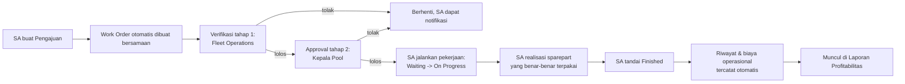

# Panduan Pengguna — Transport Management System (TMS)

Dokumen ini menjelaskan cara memakai aplikasi TMS dari awal (login) sampai alur kerja harian, per peran pengguna. Ditulis untuk pengguna sehari-hari (bukan dokumen teknis) — istilah teknis sengaja dihindari.

> **Catatan untuk pembuat dokumen:** tempat yang ditandai **[SCREENSHOT: ...]** perlu diisi gambar tangkapan layar sebelum dikirim ke pengguna.

## 1. Masuk ke Aplikasi

Ada dua cara masuk ke TMS, tergantung apakah Anda punya akun SYOP atau tidak.

### 1.1 Login lewat SYOP (SSO) — cara tercepat, kalau tersedia

Kalau akun Anda sudah terhubung dengan SYOP, cukup klik menu **"TMS"** dari dalam aplikasi SYOP yang biasa Anda pakai — Anda akan langsung masuk ke TMS tanpa perlu mengetik apa pun lagi.

**[SCREENSHOT: menu "TMS" di aplikasi SYOP]**

### 1.2 Login manual (Username & Password)

Kalau Anda belum terhubung SYOP, atau lebih suka login langsung:

1. Buka alamat TMS di browser.
2. Di halaman **Login**, isi **Username** dan **Password** Anda.
3. Klik **Masuk**.

**[SCREENSHOT: halaman login TMS]**

> Username dan password Anda diberikan oleh Admin Sistem saat akun dibuatkan. Kalau lupa password, hubungi Admin Sistem — jangan mencoba menebak, ada batas percobaan login per beberapa menit.

### Keluar (Logout)

Klik nama Anda di pojok kanan atas topbar → pilih **Keluar**.

**[SCREENSHOT: menu dropdown nama pengguna dengan opsi Keluar]**

### Struktur Cabang

PT Pro Energi memiliki 7 cabang operasional: **Jakarta, Surabaya, Samarinda, Sulawesi, Palembang, Pontianak, Banjarmasin**. Setiap cabang punya tim sendiri (Service Advisor, Fleet Operations, Kepala Pool, Tim Logistik, Admin Logistik), sedangkan **Admin IT & GA, Admin Sistem, Manajemen, dan Logistik HO** berkantor di Head Office dan bekerja lintas-cabang.

Konsekuensinya di aplikasi:
- Pengguna cabang (SA, Fleet Operations, Kepala Pool, Tim Logistik, Admin Logistik) **hanya melihat & mengelola data cabangnya sendiri** — dropdown armada, daftar pengajuan, antrian approval, dan Master Data otomatis tersaring ke cabang Anda. Field "Cabang" pada form Tambah/Ubah otomatis terkunci ke cabang Anda.
- Admin IT & GA, Admin Sistem, Manajemen, dan Logistik HO melihat data **seluruh cabang** sekaligus.
- Approval **hanya bisa dilakukan oleh Fleet Operations/Kepala Pool di cabang yang sama** dengan armada/pengajuan tersebut — mencegah, misalnya, Kepala Pool Jakarta menyetujui pengajuan cabang Samarinda.
- Kalau satu orang memegang jabatan yang sama di lebih dari satu cabang (mis. Kepala Pool merangkap 2 cabang), dia akan punya **lebih dari satu akun** — satu akun per cabang. Login-nya beda username tergantung cabang mana yang mau diproses.

## 2. Peran & Menu yang Bisa Diakses

Sidebar kiri hanya menampilkan menu yang sesuai hak akses peran Anda — kalau suatu menu tidak muncul, itu wajar (bukan error), berarti peran Anda memang tidak diberi akses ke situ.

| Peran | Deskripsi Singkat | Menu yang Bisa Diakses |
|---|---|---|
| **Service Advisor (SA)** | Ujung tombak cabang — satu-satunya yang membuat pengajuan, sekaligus yang mengerjakannya sampai selesai. | Dashboard, Pengajuan (buat & kelola milik sendiri), Armada (lihat), Master Data (lihat), Notifikasi |
| **Fleet Operations** | Verifikator tahap pertama di cabang. | Dashboard, Pengajuan (lihat, bisa edit selama giliran verifikasinya), Antrian Approval (verifikasi/tolak tahap 1), Armada (lihat), Master Data (lihat + kelola sparepart), Laporan Profitabilitas, Notifikasi |
| **Kepala Pool** | Approver tahap akhir di cabang. | Dashboard, Pengajuan (lihat), Antrian Approval (approve/tolak tahap akhir), Armada (lihat), Master Data (lihat), Notifikasi |
| **Tim Logistik** | Pengelola data master operasional cabang (kecuali sparepart & cabang). | Dashboard, Pengajuan (lihat), Armada (lihat & kelola riwayat/legalitas/BBM), Master Data (kelola driver/mekanik/vendor/gudang/jenis biaya/jenis pekerjaan), Laporan Profitabilitas, Notifikasi |
| **Admin Logistik** | Pengelola stok sparepart cabang — **hanya** sparepart. | Dashboard, Pengajuan (lihat), Armada (lihat), Master Data (lihat semua + **kelola penuh sparepart**), Laporan Profitabilitas, Notifikasi |
| **Logistik HO** | Pemantau lintas cabang dari Head Office — murni lihat-lihat, tanpa wewenang apa pun untuk mengubah. | Dashboard, Pengajuan (lihat semua cabang), Armada (lihat semua cabang), Master Data (lihat semua cabang), Laporan Profitabilitas, Notifikasi |
| **Admin IT & GA** | Pengelola aset IT/GA. | Dashboard, Asset Registry (kelola penuh), Notifikasi |
| **Manajemen** | Pemantau kinerja operasional & finansial. | Dashboard, Pengajuan (lihat), Armada (lihat), Master Data (lihat), Laporan Profitabilitas, Asset Registry (lihat), Notifikasi |
| **Admin Sistem** | Administrator sistem — akses penuh ke semua menu. | Semua menu di atas, ditambah: **Role & Permission**, **Manajemen User**, **Tahapan Approval**, **Audit Log**, **Log Sistem**, dan kelola Cabang di Master Data |

**[SCREENSHOT: sidebar menu — bisa ambil dari 2-3 role berbeda untuk menunjukkan perbedaannya, mis. SA vs Admin Sistem]**

## 3. Alur Kerja Utama: Pengajuan → Work Order → Selesai

Ini proses inti aplikasi, dari pengajuan sampai pekerjaan selesai dan otomatis masuk laporan.

Langkah-langkah:

1. **Buat Pengajuan** — SA membuka menu **Pengajuan** → **Tambah** → isi jenis (perbaikan/sparepart/restock/pembelian/lainnya), armada terkait (kalau ada), diagnosa, prioritas, estimasi lama perbaikan, pelaksana (mekanik internal atau vendor eksternal), dan lampirkan foto pendukung bila perlu. **Work Order otomatis dibuat bersamaan** — tidak perlu langkah terpisah.

   **[SCREENSHOT: form Tambah Pengajuan]**

2. **Verifikasi tahap 1 — Fleet Operations** — dibuka lewat menu **Antrian Approval**. Fleet Operations bisa **mengedit** pengajuan (mis. mengoreksi estimasi) atau **menolak** dengan alasan. Kalau ditolak, SA dapat notifikasi dan proses berhenti di situ.

   **[SCREENSHOT: halaman Antrian Approval]**

3. **Approval tahap 2 — Kepala Pool** — approval akhir. Sama seperti Fleet Operations, bisa menolak dengan alasan.

4. **Eksekusi oleh SA** — setelah lolos kedua tahap, SA membuka **Detail Work Order** dan mengubah status pelaksanaan: **Waiting → On Progress**.

   **[SCREENSHOT: Detail Work Order, tombol ubah status]**

5. **Realisasi Sparepart** — sebelum bisa menandai pekerjaan selesai, SA **wajib** mengisi sparepart yang benar-benar terpakai (boleh beda dari rencana awal). Ini titik satu-satunya stok gudang berkurang, dan **hanya untuk pelaksanaan internal** — kalau pelaksananya vendor eksternal, sparepart vendor dicatat sebagai catatan teks biasa, tidak memotong stok TMS.

   **[SCREENSHOT: form Realisasi Sparepart]**

6. **Tandai Selesai** — status Work Order menjadi **Finished**. Biaya (termasuk dari vendor eksternal) otomatis tercatat sebagai biaya operasional, dan riwayat pekerjaan otomatis muncul di tab **Riwayat** pada Detail Armada — tidak ada langkah tambahan yang perlu dilakukan siapa pun setelah ini.

   **[SCREENSHOT: Detail Armada, tab Riwayat menampilkan pekerjaan yang baru selesai]**

## 4. Master Data

Menu **Master Data** berisi data referensi yang dipakai di seluruh aplikasi (Cabang, Driver, Mekanik, Vendor/Bengkel, Gudang, Sparepart, Jenis Biaya, Jenis Pekerjaan). Siapa boleh mengubah apa **berbeda-beda per jenis data**:

| Jenis Data | Siapa Boleh Lihat | Siapa Boleh Tambah/Ubah/Hapus |
|---|---|---|
| **Cabang** | Semua peran cabang + Head Office | **Hanya Admin Sistem** |
| **Sparepart** | Semua peran cabang + Head Office | Tim Logistik, Fleet Operations, **Admin Logistik** |
| Driver, Mekanik, Vendor, Gudang, Jenis Biaya, Jenis Pekerjaan | Semua peran cabang + Head Office | Tim Logistik, Fleet Operations |

**[SCREENSHOT: halaman Master Data, tab Sparepart]**

Sebagian data Master (Driver, Armada) juga **otomatis tersinkron dari SYOP setiap jam** — jadi tidak perlu diinput manual dua kali kalau sudah ada di SYOP. Data yang memang tidak ada di SYOP (mis. nomor telepon driver) bisa dilengkapi manual kapan saja lewat Master Data, dan tidak akan tertimpa oleh sinkronisasi berikutnya.

## 5. Notifikasi

Ikon lonceng di kanan atas menunjukkan jumlah notifikasi belum dibaca, diperbarui otomatis setiap 60 detik. Notifikasi dikirim lewat **dua jalur sekaligus — di dalam aplikasi (bell icon) dan email** — untuk:

- **Approval tertunda** — ke Fleet Operations/Kepala Pool yang bertugas, setiap kali ada pengajuan baru atau naik ke tahap berikutnya.
- **Pengajuan ditolak/selesai** — ke SA yang membuat pengajuan.
- **Dokumen legalitas armada mendekati jatuh tempo** (STNK, KIR, Pajak, Asuransi) — ke Tim Logistik, dikirim otomatis setiap hari.
- **Servis berkala jatuh tempo, komponen (ban/aki/oli/rem) perlu diganti, dan stok sparepart di bawah ambang minimum** — ke role terkait di cabang masing-masing.

**[SCREENSHOT: dropdown notifikasi bell icon]**

**[SCREENSHOT: contoh email notifikasi yang masuk ke inbox]**

Klik "Lihat Semua" pada dropdown lonceng untuk membuka halaman **Notifikasi** lengkap.

## 6. Tips Umum

- Menu yang tidak muncul di sidebar bukan berarti error — itu artinya peran Anda tidak memiliki akses ke fitur tersebut.
- Lengkapi data induk (Driver, Mekanik, Vendor, Gudang, dst.) lebih dulu lewat **Master Data** sebelum mulai membuat pengajuan, supaya pilihan dropdown sudah tersedia.
- Untuk melihat kesehatan legalitas seluruh armada, cek kartu **Peringatan Legalitas** di Dashboard atau tab **Legalitas** pada Detail Armada.
- Kalau sesi Anda tiba-tiba diminta login ulang, itu wajar setelah beberapa lama tidak aktif atau setelah menutup browser — bukan berarti data Anda hilang.
- Kalau punya lebih dari satu akun (misal jadi Kepala Pool di 2 cabang), pastikan Anda login dengan username yang sesuai cabang yang mau diproses.
