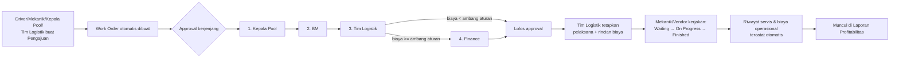

# Panduan Pengguna — Transport Management System (TMS)

Dokumen ini menjelaskan cara memakai aplikasi TMS dari awal (login) sampai alur kerja harian, per peran pengguna. Untuk detail teknis (API, skema DB, arsitektur), lihat dokumen lain di [README](README.md).

## 1. Masuk ke Aplikasi

1. Buka alamat aplikasi di browser (mis. `http://localhost:5183` untuk lingkungan pengembangan lokal).
2. Anda akan diarahkan ke halaman **Login**.
3. Pilih nama Anda pada dropdown **"Pilih pengguna"**, lalu klik **Masuk**.

> Catatan: saat ini login masih memakai mekanisme sementara (pilih user langsung, tanpa password) sampai integrasi SSO/Identity Provider bersama SYOP v4 tersedia. Setiap user sudah mewakili satu peran (role) tertentu yang menentukan menu dan aksi apa saja yang bisa diakses.

Setelah login, Anda akan diarahkan ke salah satu dari dua tampilan berikut, tergantung peran:

- **Driver / Mekanik** → **Aplikasi Lapangan** (tampilan ringan, satu kolom, cocok untuk HP).
- **Peran lainnya** (Kepala Pool, BM, Tim Logistik, Finance, Admin IT & GA, Admin Sistem, Manajemen) → **Panel Admin** (dashboard lengkap dengan sidebar menu).

### Keluar (Logout)

- **Panel Admin**: klik nama Anda di pojok kanan atas → pilih **Keluar**.
- **Aplikasi Lapangan**: klik ikon logout (⏻) di pojok kanan atas top bar.

### Struktur Cabang

PT Pro Energi memiliki 7 cabang operasional: **Jakarta, Surabaya, Samarinda, Sulawesi, Palembang, Pontianak, Banjarmasin**. Setiap cabang punya tim sendiri (Driver, Mekanik, Kepala Pool, BM, Tim Logistik), sedangkan **Admin IT & GA, Finance, Admin Sistem, dan Manajemen** berkantor di Head Office dan bekerja lintas-cabang.

Konsekuensinya di aplikasi:
- Driver/Mekanik/Kepala Pool/BM/Tim Logistik **hanya melihat & mengelola data cabangnya sendiri** — dropdown armada, daftar pengajuan, antrian approval, dan Master Data (Driver/Mekanik/Gudang) otomatis tersaring ke cabang Anda. Field "Cabang" pada form Tambah/Ubah otomatis terkunci ke cabang Anda.
- Admin IT & GA, Finance, Admin Sistem, dan Manajemen tetap melihat & bisa memilih cabang mana pun.
- Approval **hanya bisa dilakukan oleh Kepala Pool/BM/Tim Logistik di cabang yang sama** dengan armada/pengajuan tersebut — mencegah, misalnya, Kepala Pool Jakarta menyetujui pengajuan cabang Samarinda.

## 2. Aplikasi Lapangan (Driver & Mekanik)

Ditujukan untuk dipakai di lapangan lewat HP. Menu utama:

| Halaman | Fungsi |
|---|---|
| **Pengajuan Saya** | Daftar semua pengajuan yang pernah Anda buat, beserta statusnya. |
| **Buat Pengajuan** (tombol `+`) | Ajukan permintaan perbaikan, sparepart, restock, pembelian, atau lainnya — pilih jenis, armada (opsional), deskripsi, dan lampirkan foto pendukung bila perlu. |
| **Status SPK** | Buka dari daftar Pengajuan Saya (jika sudah ada Work Order) untuk melihat progres approval dan status pengerjaan. |
| **Notifikasi** | Pemberitahuan terkait pengajuan Anda (disetujui/ditolak/selesai). |

### Alur untuk Driver
1. Tekan **+** di Pengajuan Saya → isi form → **Kirim Pengajuan**.
2. Pantau status di **Pengajuan Saya** atau lewat notifikasi (bell icon).

### Alur untuk Mekanik
Selain bisa membuat pengajuan seperti Driver, Mekanik juga bertugas mengeksekusi Work Order yang sudah lolos approval:
1. Buka **Status SPK** pada Work Order yang sudah ditugaskan ke Anda.
2. Setelah status approval mencapai *Finance Approved* (atau *Completed* untuk kasus tanpa approval Finance), tombol status pelaksanaan akan aktif:
   - **Mulai Kerjakan (On Progress)** — saat mulai bekerja.
   - **Tandai Selesai (Finished)** — saat pekerjaan selesai.

## 3. Panel Admin — Menu per Peran

Sidebar kiri hanya menampilkan menu yang sesuai hak akses (permission) peran Anda. Berikut ringkasan menu dan siapa saja yang bisa mengaksesnya:

| Menu | Fungsi Singkat | Bisa Diakses (Lihat) | Bisa Kelola |
|---|---|---|---|
| **Dashboard** | KPI ringkas: total pengajuan, approval tertunda, legalitas mendekati jatuh tempo, profit bulan berjalan, grafik profit/loss per armada. | Semua peran (data ditampilkan sesuai hak akses) | — |
| **Pengajuan** | Daftar & detail pengajuan servis/sparepart/dll. | Driver, Mekanik, Kepala Pool, BM, Tim Logistik, Finance, Manajemen | Driver, Mekanik, Kepala Pool, Tim Logistik (buat pengajuan baru) |
| **Antrian Approval** | Menyetujui/menolak Work Order sesuai tahap approval Anda. | Kepala Pool, BM, Tim Logistik, Finance | idem (approve/reject) |
| **Aturan Approval** | Atur ambang biaya yang memerlukan approval Finance. | Admin Sistem | Admin Sistem |
| **Armada** | Daftar & detail armada (riwayat servis, legalitas, BBM, biaya, profit-loss). | Kepala Pool, BM, Tim Logistik, Finance, Manajemen | Tim Logistik, Admin Sistem (tambah/ubah armada) |
| **Master Data** | Data referensi: Cabang, Driver, Mekanik, Vendor/Bengkel, Gudang, Sparepart, Jenis Biaya, Jenis Pekerjaan. | Hampir semua peran (lihat) | Tim Logistik, Admin Sistem (tambah/ubah/hapus) |
| **Laporan Profitabilitas** | Laporan profit/loss seluruh armada, bisa diekspor `.xlsx`. | Tim Logistik, Finance, Manajemen | — |
| **Asset Registry** | Aset IT/GA (komputer, printer, dsb). | Admin IT & GA, Manajemen | Admin IT & GA (tambah/ubah/hapus) |
| **Notifikasi** | Riwayat notifikasi pribadi, tandai sudah dibaca. | Semua peran | — |
| **Audit Log** | Jejak perubahan approval (siapa mengubah apa, kapan). | Admin Sistem | — |

## 4. Alur Kerja Utama: Pengajuan → Work Order → Selesai

Ini adalah proses inti aplikasi, dari pengajuan sampai pekerjaan selesai dan tercatat di laporan.

Langkah-langkah:

1. **Buat Pengajuan** — Driver, Mekanik, Kepala Pool, atau Tim Logistik mengajukan lewat aplikasi lapangan atau menu **Pengajuan** (jika punya akses). Sistem otomatis membuat **Work Order** pendamping di baliknya.
2. **Approval berjenjang** — dilihat & disetujui/ditolak lewat menu **Antrian Approval**, berurutan:
   - Kepala Pool → BM → Tim Logistik → (Finance, hanya jika total biaya mencapai ambang yang diatur di **Aturan Approval**).
   - Jika ditolak di tahap manapun, pengajuan berhenti dan pengaju dapat notifikasi.
3. **Tetapkan Pelaksana** — di halaman **Detail Work Order**, Tim Logistik memilih pelaksana (mekanik internal atau vendor/bengkel eksternal) dan menambahkan rincian biaya (item pekerjaan/sparepart). Ini bisa dilakukan sebelum approval selesai, agar total biaya sudah diketahui saat menentukan apakah perlu approval Finance.
4. **Lampiran** — foto/dokumen pendukung dari pengajuan otomatis tampil di Detail Work Order; pelaksana bisa menambah lampiran lain (foto progres, invoice vendor, dsb) selama pekerjaan berlangsung.
5. **Eksekusi** — setelah approval lolos, Mekanik/Tim Logistik mengubah status pelaksanaan lewat tombol di Detail Work Order/Status SPK: **Waiting → On Progress → Finished**.
6. **Selesai otomatis tercatat** — begitu status jadi *Finished* dan approval *Completed*, sistem otomatis mencatat riwayat perawatan armada dan biaya operasional — langsung terlihat di tab **Riwayat**/**Biaya** pada Detail Armada dan di **Laporan Profitabilitas**.

## 5. Notifikasi

Ikon lonceng di kanan atas (tersedia di kedua tampilan) menunjukkan jumlah notifikasi belum dibaca, dengan pembaruan otomatis setiap 60 detik. Notifikasi dikirim otomatis untuk:
- **Approval tertunda** — ke role yang bertugas menyetujui tahap berikutnya, setiap kali Work Order dibuat atau naik ke tahap baru.
- **Pengajuan ditolak/selesai** — ke pengaju.
- **Dokumen legalitas armada mendekati jatuh tempo** (STNK, KIR, Pajak, Asuransi) — ke Tim Logistik, dikirim otomatis setiap hari.

Klik "Lihat Semua" pada dropdown lonceng untuk membuka halaman **Notifikasi** lengkap, dengan tab Semua/Belum Dibaca/Sudah Dibaca dan tombol "Tandai Semua Dibaca".

## 6. Tips Umum

- Menu yang tidak muncul di sidebar bukan berarti error — itu artinya peran Anda tidak memiliki akses ke fitur tersebut (hak akses diatur granular per peran).
- Data induk (Cabang, Driver, Mekanik, Vendor, dst.) sebaiknya dilengkapi lebih dulu oleh Tim Logistik/Admin Sistem lewat menu **Master Data** sebelum pengguna lain mulai membuat pengajuan, supaya pilihan dropdown (armada, mekanik, vendor, dll.) sudah tersedia.
- Untuk melihat kesehatan legalitas seluruh armada (dokumen yang mendekati/lewat jatuh tempo), cek kartu **Peringatan Legalitas** di Dashboard atau tab **Legalitas** pada Detail Armada.
