# Product Requirements Document (PRD) — POD Mobile App v1.0

> **Sistem terpisah dari TMS** — aplikasi mobile (Flutter, Android & iOS) untuk driver, dengan backend & database sendiri. Terhubung ke TMS hanya lewat sinkronisasi data untuk kebutuhan monitoring, mengikuti pola integrasi yang sama seperti TMS↔SYOP (lihat [TMS Architecture Document Bagian 8.3](../02-Architecture.md)). Dokumen ini **belum final** — beberapa keputusan (lihat Bagian 9) masih perlu dikonfirmasi sebelum desain teknis dimulai.

## 1. Latar Belakang

TMS saat ini sudah menangani pengajuan perbaikan, Work Order, approval, master data armada/driver, dan profitabilitas — tapi tidak ada visibilitas terhadap driver **selagi bertugas di lapangan**: kapan berangkat, posisi terkini, kapan sampai tujuan, dan bukti serah terima pengiriman (Proof of Delivery/POD) masih dilakukan manual atau tidak terdokumentasi secara terpusat.

POD Mobile App dibutuhkan sebagai alat kerja digital untuk driver — berbeda bentuk (aplikasi mobile native, bukan web) sehingga dibangun sebagai proyek terpisah dari TMS, namun datanya perlu terlihat oleh Tim Logistik/Manajemen dari dalam TMS supaya tidak perlu buka dua sistem berbeda untuk memantau operasional armada.

## 2. Tujuan Sistem

- Menyediakan driver alat kerja mobile untuk menerima tugas (trip), melakukan tracking lokasi selama perjalanan, dan mengonfirmasi pengiriman dengan bukti digital.
- Menyediakan visibilitas posisi & status driver/armada secara near-real-time bagi Tim Logistik/Manajemen, ditampilkan di dalam TMS (bukan aplikasi terpisah untuk monitoring).
- Mendigitalisasi bukti serah terima (foto, tanda tangan) yang selama ini manual/tidak terdokumentasi terpusat.

## 3. Ruang Lingkup

### 3.1 Dalam Lingkup

- Aplikasi mobile Flutter (Android & iOS) khusus untuk **Driver**.
- Autentikasi driver dengan kredensial khusus aplikasi ini (PIN/password) — **bukan** akun TMS penuh, tapi identitasnya terhubung ke data driver yang sama dengan master data TMS (lihat Bagian 8).
- Daftar & detail trip/tugas yang ditugaskan ke driver.
- Update status trip (Berangkat → Dalam Perjalanan → Tiba di Lokasi → Selesai).
- Tracking lokasi GPS berkala selama trip berstatus aktif.
- Proof of Delivery: foto bukti serah terima, tanda tangan digital penerima, catatan teks.
- Riwayat trip driver yang sudah selesai, beserta POD-nya.
- Backend API + database khusus POD (terpisah sepenuhnya dari backend TMS).
- Sinkronisasi data (lokasi terkini, status trip aktif, riwayat trip selesai + POD) dari backend POD ke TMS, ditampilkan sebagai dashboard monitoring di dalam TMS untuk role Tim Logistik/Logistik HO/Manajemen.

### 3.2 Luar Lingkup (Fase Ini)

- Optimasi/rekomendasi rute otomatis.
- Perhitungan ongkos kirim/tarif otomatis.
- Chat/komunikasi dua arah driver ↔ dispatcher di dalam aplikasi.
- Mode offline penuh berkepanjangan (diasumsikan konektivitas seluler tersedia selama trip — lihat NFR-03 untuk penanganan putus koneksi *sementara*, bukan operasi offline berhari-hari).
- Pendaftaran driver baru langsung dari aplikasi (driver harus sudah terdaftar di TMS lebih dulu, lihat Bagian 9).

## 4. Pengguna & Peran

| Role | Deskripsi | Akses Utama |
|---|---|---|
| **Driver** | Pengemudi armada — satu-satunya pengguna aplikasi mobile ini. | Login, lihat daftar trip, update status trip, tracking GPS otomatis selama trip aktif, isi Proof of Delivery, lihat riwayat trip sendiri. |
| **Tim Logistik / Logistik HO / Manajemen** (di sisi TMS, bukan pengguna app mobile) | Memantau operasional driver/armada dari dalam TMS. | Melihat (read-only) dashboard monitoring — posisi terkini, status trip aktif, riwayat POD — di halaman TMS yang baru. |

## 5. Alur Bisnis

### 5.1 Alur Trip & Proof of Delivery

```mermaid
flowchart LR
    A[Trip ditugaskan ke driver] --> B[Driver terima notifikasi\ndi app]
    B --> C[Driver mulai perjalanan:\nstatus Berangkat]
    C --> D[App kirim update lokasi GPS\nberkala selama trip aktif]
    D --> E[Driver tiba di lokasi:\nstatus Tiba]
    E --> F[Driver isi Proof of Delivery:\nfoto + tanda tangan + catatan]
    F --> G[Status Selesai]
    G --> H[Data disinkronkan ke TMS]
    H --> I[Tampil di dashboard monitoring\nTim Logistik/Manajemen]
```

1. **Penugasan trip** — trip/tugas ditugaskan ke driver tertentu. *(Sumber penugasan — apakah dari dispatcher di aplikasi POD sendiri, atau trip diturunkan dari data lain, misalnya SYOP/TMS — belum diputuskan, lihat Bagian 9).*
2. **Driver terima tugas** — muncul di daftar trip aplikasi, driver mendapat notifikasi.
3. **Berangkat** — driver menandai mulai perjalanan; aplikasi mulai mengirim update lokasi GPS secara berkala.
4. **Dalam perjalanan** — lokasi ter-update berkala ke backend POD; TMS dapat menampilkan posisi terkini di peta (lewat sinkronisasi, lihat Bagian 8).
5. **Tiba di lokasi** — driver menandai sampai tujuan.
6. **Proof of Delivery** — driver mengisi foto bukti serah terima, tanda tangan digital penerima, dan catatan bila perlu.
7. **Selesai** — trip ditandai selesai; data (waktu tempuh, rute/riwayat titik lokasi, POD) tersimpan permanen dan disinkronkan ke TMS untuk riwayat & laporan.

## 6. Kebutuhan Fungsional

Prioritas MoSCoW: Must have (M), Should have (S), Could have (C).

### Modul Autentikasi

| ID | Kebutuhan | Prioritas |
|---|---|---|
| FR-01 | Driver login menggunakan kredensial khusus aplikasi POD (PIN atau password) — terhubung ke identitas driver yang sama dengan master data `drivers` di TMS (lihat Bagian 8). | M |
| FR-02 | Sistem menolak login untuk driver yang statusnya sudah nonaktif di TMS. | M |

### Modul Trip

| ID | Kebutuhan | Prioritas |
|---|---|---|
| FR-03 | Driver dapat melihat daftar trip yang ditugaskan kepadanya, dengan status masing-masing. | M |
| FR-04 | Driver dapat melihat detail satu trip (tujuan, waktu, catatan penugasan). | M |
| FR-05 | Driver dapat mengubah status trip: Berangkat → Dalam Perjalanan → Tiba di Lokasi → Selesai. | M |
| FR-06 | Driver menerima notifikasi push saat ada trip baru ditugaskan. | S |

### Modul Tracking Lokasi

| ID | Kebutuhan | Prioritas |
|---|---|---|
| FR-07 | Aplikasi mengirim update lokasi GPS secara berkala ke backend selama trip berstatus aktif (Berangkat/Dalam Perjalanan). | M |
| FR-08 | Backend menyimpan riwayat titik lokasi per trip (untuk keperluan audit rute/playback, bukan cuma titik terakhir). | S |
| FR-09 | Tracking lokasi otomatis berhenti saat trip tidak aktif (Selesai atau belum Berangkat) — supaya baterai/kuota driver tidak terkuras di luar jam kerja. | M |

### Modul Proof of Delivery

| ID | Kebutuhan | Prioritas |
|---|---|---|
| FR-10 | Driver dapat mengunggah satu atau lebih foto sebagai bukti serah terima. | M |
| FR-11 | Driver dapat merekam tanda tangan digital penerima langsung di layar aplikasi. | M |
| FR-12 | Driver dapat menambahkan catatan teks bebas pada Proof of Delivery. | S |
| FR-13 | Trip tidak dapat ditandai "Selesai" sebelum Proof of Delivery minimal terisi foto. | M |

### Modul Riwayat

| ID | Kebutuhan | Prioritas |
|---|---|---|
| FR-14 | Driver dapat melihat riwayat trip miliknya yang sudah selesai, beserta Proof of Delivery masing-masing. | M |

### Modul Integrasi dengan TMS

| ID | Kebutuhan | Prioritas |
|---|---|---|
| FR-15 | Backend POD menyediakan API yang bisa diakses TMS untuk mengambil data: lokasi terkini driver/trip aktif, status trip berjalan, dan riwayat trip selesai beserta Proof of Delivery-nya. | M |
| FR-16 | TMS menyinkronkan data dari backend POD secara berkala (bukan real-time per klik), disimpan sebagai cache di `tms_db` — mengikuti pola yang sama dengan sinkronisasi SYOP (lihat [Architecture Document Bagian 8.3](../02-Architecture.md)). | M |
| FR-17 | TMS menampilkan dashboard monitoring baru (posisi driver/armada terkini di peta, daftar trip aktif, riwayat Proof of Delivery) — dapat diakses role Tim Logistik, Logistik HO, dan Manajemen. | M |

## 7. Kebutuhan Non-Fungsional

| ID | Kategori | Kebutuhan |
|---|---|---|
| NFR-01 | Performance | Interval update lokasi GPS wajar (mis. tiap 30–60 detik selama trip aktif) — bukan tiap detik, supaya tidak menguras baterai/kuota driver secara berlebihan. Nilai pasti perlu disepakati bersama tim mobile. |
| NFR-02 | Battery & Data Usage | Aplikasi dioptimalkan untuk device Android kelas bawah (umum dipakai driver lapangan) dan konsumsi data seluler minimal. |
| NFR-03 | Resiliency | Kalau sinyal hilang sementara, update lokasi & data Proof of Delivery di-buffer lokal di perangkat dan dikirim ulang otomatis begitu koneksi kembali — tidak boleh hilang. |
| NFR-04 | Security | Kredensial driver disimpan terenkripsi; seluruh komunikasi API pakai HTTPS; foto/tanda tangan disimpan dengan akses terbatas (bukan URL publik tanpa autentikasi). |
| NFR-05 | Compatibility | Mendukung Android & iOS versi yang masih wajar dipakai di lapangan — versi minimum perlu ditentukan bersama tim mobile berdasar device yang benar-benar dipakai driver saat ini. |
| NFR-06 | Availability | Dashboard monitoring di TMS tetap bisa menampilkan data terakhir yang berhasil disinkronkan meskipun backend POD sedang tidak dapat dihubungi sesaat (data terakhir yang ada, bukan error kosong). |

## 8. Arsitektur & Integrasi dengan TMS

- **Backend POD sepenuhnya terpisah** dari backend Laravel TMS — API sendiri, database sendiri. Tidak seperti integrasi SYOP (yang kebetulan satu instance MySQL dengan TMS), backend POD kemungkinan besar berada di infrastruktur/server berbeda, sehingga integrasi ke TMS **wajib lewat HTTP API**, bukan akses database lintas sistem secara langsung.
- **Pola integrasi mengikuti prinsip yang sama dengan `SyopDataProvider`/`SyopNativeAdapter`** di TMS (lihat [Architecture Document Bagian 8.3](../02-Architecture.md)): TMS punya satu lapisan adapter khusus (mis. `PodDataProviderInterface`/`PodApiAdapter`) sebagai satu-satunya titik akses ke data POD — supaya kalau backend POD berubah/diganti di masa depan, TMS tidak perlu ubah logika bisnis di banyak tempat.
- **Penghubung identitas driver**: `drivers.id` (atau `syop_driver_id`) di TMS menjadi kunci yang sama dipakai backend POD untuk mengaitkan akun login driver ke data master TMS. Provisioning akun POD untuk seorang driver (mis. Tim Logistik/Admin Logistik memilih driver dari daftar TMS lalu membuatkan kredensial POD-nya) — mekanisme persisnya perlu didesain di Design Document setelah PRD ini disepakati.
- **Arah sinkronisasi**: satu arah, dari backend POD **ke** TMS (TMS cuma membaca, tidak pernah menulis balik ke sistem POD) — sama seperti prinsip integrasi SYOP.

## 9. Asumsi & Batasan

- Driver di aplikasi POD **harus sudah terdaftar** sebagai master data `drivers` di TMS lebih dulu (lewat sinkronisasi SYOP yang sudah berjalan, atau input manual) — aplikasi POD tidak punya alur pendaftaran driver baru dari nol.
- Konektivitas data seluler tersedia di sebagian besar rute operasional driver — mode offline berkepanjangan (berjam-jam/berhari-hari) di luar cakupan fase ini (lihat NFR-03 untuk gangguan sinyal *sementara*, bukan operasi offline penuh).
- **Belum diputuskan, perlu dikonfirmasi sebelum Design Document dimulai:**
  - Siapa/sistem apa yang menugaskan trip ke driver — dispatcher manual di dalam aplikasi POD sendiri, atau trip diturunkan otomatis dari data lain (mis. dari Work Order TMS, atau dari SYOP)?
  - Mekanisme provisioning kredensial POD untuk driver (siapa yang membuatkan, dari mana PIN/password awal berasal).
  - Apakah satu driver bisa punya lebih dari satu trip aktif bersamaan, atau strictly satu per satu.

## 10. Risiko & Mitigasi

| Risiko | Dampak | Mitigasi |
|---|---|---|
| Dua sistem identitas driver (master data TMS vs kredensial aplikasi POD) bisa tidak sinkron kalau tidak dikelola hati-hati. | Driver tidak bisa login, atau data POD tidak bisa dikaitkan ke driver yang benar di TMS. | Satu sumber kebenaran tetap `drivers` di TMS — backend POD cuma menyimpan referensi ID + kredensial tambahan khusus aplikasi, bukan menduplikasi data driver. |
| GPS aktif terus-menerus menguras baterai HP driver. | Driver enggan memakai aplikasi, atau HP mati di tengah trip. | Interval update disesuaikan (NFR-01), tracking otomatis nonaktif saat trip tidak berjalan (FR-09). |
| Foto & tanda tangan Proof of Delivery menumpuk, memakan storage besar seiring waktu. | Biaya storage membengkak. | Kompresi gambar sebelum diunggah, kebijakan retensi data disepakati kemudian. |
| Backend POD tidak tersedia (down) saat TMS mencoba sinkronisasi. | Dashboard monitoring TMS menampilkan data basi/kosong. | TMS menyimpan data hasil sinkron terakhir sebagai cache (NFR-06), tidak bergantung pada backend POD selalu online setiap saat halaman dashboard dibuka. |
| Sumber penugasan trip belum jelas (lihat Bagian 9) — bisa menyebabkan pekerjaan desain ulang kalau diasumsikan salah di awal. | Waktu development terbuang untuk fitur yang arahnya berubah. | Konfirmasi dengan pemilik proses sebelum Design Document/pengembangan teknis dimulai. |

## 11. Metrik Keberhasilan

- % trip selesai yang punya Proof of Delivery lengkap (foto + tanda tangan) dibanding total trip selesai.
- Rata-rata keterlambatan update lokasi yang diterima TMS (seberapa "real-time" data yang ditampilkan).
- % driver aktif (dari total driver terdaftar di TMS) yang benar-benar memakai aplikasi POD secara rutin.
- Pengurangan keluhan/sengketa terkait bukti pengiriman dibanding sebelum ada Proof of Delivery digital.

## 12. Roadmap Pengembangan (Ringkas)

| Fase | Fokus |
|---|---|
| Fase 1 | Autentikasi driver + daftar & detail trip + update status manual (tanpa GPS tracking dulu). |
| Fase 2 | Tracking lokasi GPS real-time + pengiriman berkala ke backend POD. |
| Fase 3 | Proof of Delivery (foto + tanda tangan + catatan) + riwayat trip driver. |
| Fase 4 | Integrasi ke TMS: adapter data, sinkronisasi berkala, dashboard monitoring untuk Tim Logistik/Logistik HO/Manajemen. |

Setelah PRD ini disepakati, dokumen lanjutan (Architecture Document, Design Document, Wireframe) dapat disusun mengikuti pola yang sama seperti dokumentasi TMS (lihat [docs/README.md](../README.md)).

## 13. Glosarium

| Istilah | Penjelasan |
|---|---|
| **POD** | Proof of Delivery — bukti digital serah terima pengiriman (foto, tanda tangan, catatan). |
| **Trip** | Satu penugasan perjalanan/pengiriman untuk seorang driver, dari awal (Berangkat) sampai selesai. |
| **Driver** | Pengemudi armada, satu-satunya pengguna aplikasi mobile ini — datanya sama dengan master data `drivers` di TMS. |
| **Backend POD** | Sistem backend (API + database) khusus aplikasi POD, terpisah dari backend TMS. |
| **Adapter** | Lapisan abstraksi di TMS yang membaca data dari backend POD, mengikuti pola yang sama dengan `SyopDataProvider` untuk integrasi SYOP. |

---

**Riwayat Dokumen**

| Versi | Tanggal | Perubahan |
|---|---|---|
| 1.0 | 2026-09-09 | Draft awal, disusun berdasarkan diskusi awal dengan pemilik proses. Beberapa keputusan (Bagian 9) masih terbuka dan perlu dikonfirmasi sebelum lanjut ke Design Document. |
