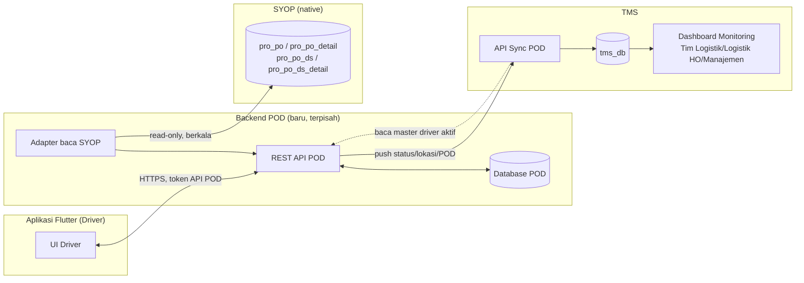

# Product Requirements Document (PRD) — POD ProEnergi v2.0

> **Sistem terpisah dari TMS** — aplikasi mobile Flutter (Android prioritas utama, iOS menyusul) untuk Driver, dengan backend & database sendiri. Menggantikan aplikasi pihak ketiga **JAVAZ**. Terhubung ke SYOP (baca data penugasan) dan ke TMS (kirim data monitoring) **lewat API, bukan koneksi database langsung dari aplikasi mobile** — lihat Bagian 11 untuk jawaban lengkap atas pertanyaan arsitektur ini. Versi 2.0 menggabungkan draf bisnis lengkap (fitur per layar, hasil kajian pembanding JAVAZ vs desain rujukan) dengan keputusan arsitektur teknis TMS yang sudah disepakati sebelumnya.

## 1. Ringkasan & Sasaran Utama

PT Pro Energi saat ini menggunakan aplikasi mobile pihak ketiga bernama **JAVAZ** sebagai alat bantu pengemudi (driver) armada BBM dan logistik untuk mencatat proses pengiriman (shipment), mulai dari titik muat hingga titik bongkar, termasuk pengambilan bukti serah terima (Proof of Delivery/POD) berupa foto dan tanda tangan digital.

Sebagai bagian dari inisiatif digitalisasi internal, perusahaan akan membangun aplikasi baru bernama **"POD ProEnergi"** secara in-house (dibangun dari nol), untuk menggantikan JAVAZ. Tujuannya adalah memberikan kendali penuh atas data operasional, mempermudah integrasi dengan sistem inti perusahaan (SYOP) serta dengan TMS, dan menghadirkan pengalaman pengguna yang lebih baik dengan identitas visual Pro Energi (tema warna Biru & Oranye).

Sebagai baseline fitur, dilakukan kajian pembanding terhadap desain alternatif ("materi OSPOD", disebut "HITA" pada materi rujukan) yang telah menyempurnakan sejumlah kekurangan JAVAZ — di antaranya penambahan informasi nama customer dan plat nomor kendaraan pada kartu shipment, status shipment yang lebih informatif, fitur penunjuk arah langsung ke Google Maps, catatan yang tampil langsung pada layar (tanpa pop-up terpisah), dan alur konfirmasi yang lebih ringkas. Dokumen ini mengadopsi seluruh penyempurnaan tersebut sebagai fitur inti, kemudian melengkapinya dengan kebutuhan non-fungsional, model data, integrasi sistem (SYOP & TMS), dan rekomendasi pengembangan lanjutan.

**Sasaran Utama Produk:**

- Mengganti ketergantungan pada aplikasi pihak ketiga (JAVAZ) dengan aplikasi milik perusahaan sendiri.
- Menstandarkan dan mendigitalkan seluruh proses pencatatan shipment — dari penugasan, perjalanan menuju lokasi, hingga bukti serah terima muat dan bongkar.
- Menyediakan data operasional yang akurat dan real-time untuk kebutuhan pelaporan dan integrasi dengan SYOP dan TMS.
- Meningkatkan pengalaman pengguna (driver) melalui alur kerja yang lebih ringkas, informatif, dan andal di lapangan.
- Menghadirkan identitas visual yang konsisten dengan citra merek Pro Energi (tema Biru & Oranye).

## 2. Latar Belakang & Tujuan

### 2.1 Latar Belakang

PT Pro Energi mengoperasikan distribusi BBM dan logistik melalui armada yang tersebar di tujuh cabang. Proses pencatatan shipment saat ini bergantung pada aplikasi JAVAZ milik pihak ketiga, yang memiliki sejumlah keterbatasan pada tampilan informasi (mis. informasi customer dan kendaraan tidak langsung terlihat pada kartu shipment), proses pencatatan catatan yang terpisah dari layar utama (melalui pop-up setelah tanda tangan tersimpan), serta ketergantungan pada vendor eksternal untuk pengembangan fitur lanjutan dan integrasi data ke sistem inti perusahaan (SYOP).

Dengan membangun aplikasi sendiri, tim IT Development Pro Energi dapat mengendalikan penuh roadmap fitur, kualitas data, keamanan, serta kecepatan integrasi dengan sistem back-office perusahaan (SYOP untuk data penugasan, TMS untuk monitoring armada/driver).

### 2.2 Tujuan Dokumen

Dokumen ini bertujuan menjadi acuan tunggal (single source of truth) bagi tim produk, desain, dan pengembang dalam membangun aplikasi POD ProEnergi, mencakup:

- Definisi ruang lingkup dan batasan sistem yang akan dibangun.
- Kebutuhan fungsional setiap modul aplikasi, lengkap dengan aturan bisnis dan kriteria penerimaan.
- Kebutuhan non-fungsional (keamanan, performa, keandalan di lapangan, dsb.).
- Panduan desain dan identitas visual (tema Biru & Oranye).
- Model data, kebutuhan integrasi sistem dengan SYOP dan TMS, serta asumsi dan risiko proyek.
- Rekomendasi fitur lanjutan dan usulan tahapan pengembangan (roadmap).

## 3. Ruang Lingkup

### 3.1 Dalam Lingkup (In-Scope)

- Aplikasi mobile untuk pengguna **Driver**, platform Android sebagai prioritas utama (iOS dapat menyusul pada fase berikutnya bila dibutuhkan).
- Seluruh alur kerja shipment: autentikasi, daftar & detail shipment, mulai shipment, navigasi ke lokasi, check-in lokasi, pengisian laporan (report) di lokasi muat dan bongkar, pengambilan foto bukti, tanda tangan digital, catatan, penyelesaian shipment, serta riwayat shipment.
- Profil pengguna dasar (identitas driver, kendaraan yang digunakan, logout).
- **Integrasi baca (read) dari SYOP**: backend POD membaca data penugasan shipment dari tabel `pro_po`, `pro_po_detail`, `pro_po_ds`, `pro_po_ds_detail` di database native SYOP — penugasan (assignment) shipment ke driver dilakukan oleh **Logistik Cabang di SYOP**, bukan di aplikasi POD maupun di TMS (lihat Bagian 11).
- **Integrasi kirim (push) ke TMS**: status trip aktif, lokasi terkini, dan hasil Proof of Delivery disinkronkan ke TMS untuk ditampilkan sebagai dashboard monitoring bagi Tim Logistik/Logistik HO/Manajemen — TMS menjadi satu-satunya tempat monitoring, **bukan** dashboard terpisah di SYOP maupun di POD (lihat Bagian 11).
- **Provisioning akun POD driver dilakukan lewat TMS**, dieksekusi oleh IT untuk saat ini (lihat Bagian 11 & 14).
- Panduan desain UI/UX dan tema visual (Biru & Oranye) yang konsisten di seluruh layar.

### 3.2 Di Luar Lingkup (Out-of-Scope) pada Rilis Awal

- Dashboard/portal back-office untuk Admin atau Dispatcher **di dalam aplikasi POD sendiri** — dashboard monitoring disediakan di **TMS** (bukan di SYOP maupun aplikasi terpisah lain), lihat Bagian 3.1. PRD ini mendefinisikan kontrak data/API yang dibutuhkan dari sisi mobile app dan backend POD ke TMS.
- Modul penggajian atau insentif driver.
- Manajemen master data kendaraan, customer, dan rute (dikelola di SYOP; aplikasi mobile & backend POD hanya mengonsumsi data tersebut secara read-only).
- Manajemen master data driver (dikelola di TMS; backend POD mengonsumsi/mereferensikan `drivers.id` milik TMS, tidak mendupliksi sebagai sumber kebenaran baru).
- Fitur pelacakan (tracking) real-time di peta untuk pemantauan armada oleh publik/eksternal — yang disediakan hanya dashboard internal di TMS untuk role Logistik (Bagian 16 mencantumkan rekomendasi lanjutan seputar ini).
- Penugasan (assignment) trip dari dalam aplikasi POD — assignment sepenuhnya terjadi di SYOP oleh Logistik Cabang; POD hanya membaca hasilnya (lihat Bagian 11).

## 4. Definisi & Istilah

| Istilah | Penjelasan |
|---|---|
| **POD** | Proof of Delivery — bukti digital serah terima pengiriman (foto, tanda tangan, catatan). |
| **POD ProEnergi** | Nama aplikasi mobile in-house yang dibangun untuk menggantikan JAVAZ. |
| **JAVAZ** | Aplikasi mobile pihak ketiga yang saat ini dipakai driver, akan digantikan oleh POD ProEnergi. |
| **Shipment** | Satu penugasan pengiriman untuk seorang driver, dari titik muat ke titik bongkar, setara dengan satu kombinasi PO/DS di SYOP (lihat baris berikut). |
| **PO (`pro_po`)** | Tabel header pesanan/pengiriman di database native SYOP. |
| **PO Detail (`pro_po_detail`)** | Tabel rincian muatan/item per PO di SYOP. |
| **PO DS (`pro_po_ds`)** | Tabel penjadwalan pengiriman (Delivery Schedule) di SYOP — di sinilah shipment ditugaskan (assign) ke armada & driver tertentu oleh Logistik Cabang. |
| **PO DS Detail (`pro_po_ds_detail`)** | Rincian titik lokasi (muat/bongkar) per penjadwalan (DS) di SYOP. |
| **Logistik Cabang** | Staf logistik di tiap cabang SYOP yang membuat/mengelola PO DS — pihak yang menugaskan shipment ke driver. Bukan pengguna aplikasi POD ProEnergi. |
| **Driver** | Pengemudi armada BBM/logistik — satu-satunya pengguna aplikasi mobile POD ProEnergi. Identitasnya sama dengan master data driver di TMS. |
| **Backend POD** | Sistem backend (API + database) khusus aplikasi POD, terpisah dari backend TMS dan dari SYOP. |
| **Check-in** | Aksi driver menandai kedatangan di suatu titik lokasi (muat/bongkar), mencatat waktu masuk secara otomatis. |
| **Report** | Layar pencatatan bukti (foto, tanda tangan, catatan) untuk satu aktivitas (muat atau bongkar). |
| **PIN** | Kredensial login driver di aplikasi POD (bukan password akun TMS/SYOP) — diprovisioning lewat TMS. |
| **Sinkronisasi (Sync)** | Proses pengiriman data dari backend POD ke TMS secara berkala/event-driven untuk kebutuhan dashboard monitoring. |
| **Adapter** | Lapisan abstraksi (kode) yang menjadi satu-satunya titik akses ke sistem eksternal (SYOP atau POD), mengikuti pola `SyopDataProviderInterface`/`SyopNativeAdapter` yang sudah dipakai di TMS. |

## 5. Pengguna & Peran (User Roles)

| Role | Sistem | Deskripsi | Akses Utama |
|---|---|---|---|
| **Driver** | Aplikasi POD ProEnergi (mobile) | Pengemudi armada — satu-satunya pengguna aplikasi mobile ini. | Login (username+PIN), lihat shipment ditugaskan, jalankan alur muat/bongkar, isi POD, lihat riwayat, profil & logout. |
| **Logistik Cabang** | SYOP (di luar cakupan aplikasi POD) | Membuat & menugaskan shipment (PO/PO Detail/PO DS/PO DS Detail) ke driver & armada per cabang. | Tidak memakai aplikasi POD ProEnergi maupun TMS untuk tugas ini — dikerjakan di SYOP, hanya dibaca oleh backend POD (lihat Bagian 11). |
| **IT / Admin Sistem** | TMS | Melakukan provisioning (membuat/reset) kredensial akun POD untuk driver, untuk saat ini dikerjakan manual oleh IT. | Panel Master Data Driver di TMS, aksi "Buat/Reset Akun POD" (lihat Bagian 11 & 14). |
| **Tim Logistik / Logistik HO / Manajemen** | TMS (read-only) | Memantau operasional driver/armada dari dashboard monitoring di TMS. | Melihat posisi terkini, status shipment aktif, dan riwayat POD — tidak mengakses aplikasi/backend POD secara langsung. |

## 6. Alur Proses Bisnis (End-to-End)

Alur berikut menggambarkan siklus hidup satu shipment dari sudut pandang driver, dari penugasan hingga selesai, dan menjadi acuan urutan modul fungsional pada Bagian 7. Langkah 0 (penugasan) menambahkan asal-usul data yang sebelumnya belum tercakup di alur driver saja.

0. **Penugasan shipment** — Logistik Cabang membuat PO/PO Detail dan menjadwalkannya (PO DS/PO DS Detail) ke armada & driver tertentu di SYOP. Backend POD membaca data ini secara berkala (lihat Bagian 11) dan menampilkannya sebagai shipment di aplikasi driver yang bersangkutan.
1. Driver login ke aplikasi menggunakan username & PIN.
2. Driver melihat shipment yang ditugaskan pada layar Beranda, lengkap dengan nomor shipment, customer, plat nomor kendaraan, tanggal, dan titik lokasi.
3. Driver menekan tombol "Mulai" untuk memulai shipment yang dipilih.
4. Driver menggunakan fitur penunjuk arah untuk dipandu via Google Maps menuju lokasi muat.
5. Setibanya di lokasi, driver melakukan check-in "Sampai Lokasi" untuk mencatat waktu masuk dan memulai aktivitas muat.
6. Driver mengisi laporan (report) di lokasi muat: memastikan data customer/alamat, menambahkan catatan bila perlu, mengambil foto bukti, dan mengambil tanda tangan.
7. Driver menyelesaikan aktivitas muat ("Selesai Muat") setelah foto dan tanda tangan lengkap, yang tercatat sebagai waktu selesai muat & keluar lokasi.
8. Driver menggunakan kembali fitur penunjuk arah menuju lokasi bongkar (customer tujuan).
9. Driver melakukan check-in "Sampai Lokasi" di lokasi bongkar, lalu mengisi laporan bongkar (catatan, foto bukti, tanda tangan penerima).
10. Driver menyelesaikan aktivitas bongkar ("Selesai Bongkar"), yang menutup status shipment menjadi selesai dan tercatat pada riwayat (history) shipment — data ini kemudian disinkronkan ke TMS (lihat Bagian 11).

> **Catatan:** satu shipment pada baseline ini memiliki pola dua titik (satu lokasi muat, satu lokasi bongkar) sesuai materi rujukan, selaras dengan keputusan bahwa satu driver hanya memiliki **satu shipment/trip aktif** pada satu waktu (lihat Bagian 9/14). Model data pada Bagian 10 dirancang agar dapat diperluas ke pola multi-titik (multi-drop) sebagai pengembangan lanjutan (lihat Bagian 16).

## 7. Kebutuhan Fungsional

Setiap kebutuhan fungsional (FR) berikut disusun mengikuti urutan alur bisnis pada Bagian 6. Baseline fungsional mengadopsi seluruh penyempurnaan yang teridentifikasi pada desain rujukan (ditandai sebagai fitur baru), sekaligus mempertahankan fungsi inti yang telah terbukti pada aplikasi berjalan. FR-1 s.d. FR-15 berfokus pada modul yang dilihat driver di aplikasi mobile; FR-16 s.d. FR-18 (modul baru, Bagian 7.1) melengkapi kebutuhan integrasi backend yang menjawab langsung pertanyaan koneksi ke SYOP dan TMS.

### FR-1 — Autentikasi & Login

Driver masuk ke aplikasi menggunakan kredensial akun yang diterbitkan perusahaan (terhubung ke data driver di TMS, lihat Bagian 11).

Referensi desain: Login disederhanakan menjadi Username + PIN + tombol Login pada satu layar bersih dengan logo POD ProEnergi, dibanding versi lama yang menampilkan ilustrasi besar serta opsi login QR dan pendaftaran mandiri pada layar yang sama.

**Elemen & Field Data:**
- Input Username (teks).
- Input PIN (numerik, tersamarkan dengan opsi tampilkan/sembunyikan).
- Tombol Login (primary button, warna Biru).
- Nomor versi aplikasi (ditampilkan kecil di footer layar login).

**Aturan Bisnis / Validasi:**
- PIN minimal 6 digit numerik; disimpan/ditransmisikan dalam bentuk terenkripsi, tidak pernah dalam bentuk plain text.
- Akun terkunci sementara setelah 5 kali percobaan PIN salah berturut-turut, dengan pesan yang mengarahkan ke Admin/Dispatcher (IT, lewat TMS) untuk reset.
- Sesi login (token) memiliki masa berlaku dan diperbarui otomatis selama aplikasi aktif digunakan; wajib login ulang setelah logout eksplisit atau token kedaluwarsa.
- Tidak ada opsi pendaftaran mandiri (self-registration) — akun hanya bisa dibuat lewat provisioning di TMS oleh IT (lihat Bagian 11).
- Opsional (fase berikutnya): login biometrik (sidik jari/wajah) sebagai jalan pintas setelah login pertama berhasil — lihat Bagian 16.

**Kriteria Penerimaan:**
- Driver dengan kredensial valid berhasil masuk ke layar Beranda dalam satu kali submit.
- Kredensial tidak valid menampilkan pesan kesalahan yang jelas tanpa membuka informasi apakah username atau PIN yang salah (mitigasi keamanan).
- Toggle tampilkan/sembunyikan PIN berfungsi tanpa memuat ulang layar.

### FR-2 — Beranda (Home) & Kartu Shipment

Layar utama menampilkan sapaan kepada driver beserta shipment yang sedang ditugaskan/berjalan, dalam bentuk kartu ringkas dengan seluruh informasi penting yang dibutuhkan sebelum berangkat.

Referensi desain: Kartu shipment baru menambahkan Nama Customer, Plat Nomor Kendaraan (License Plate), dan Status Shipment yang tidak tersedia secara eksplisit pada versi lama; ikon Riwayat (History) dipindahkan ke header agar bottom navigation lebih ringkas (Home, Profil).

**Elemen & Field Data:**
- Header sapaan: foto/avatar driver, nama driver, pesan status singkat, ikon akses Riwayat Shipment.
- Kartu shipment: Nomor Shipment, Status Shipment (badge berwarna), Plat Nomor Kendaraan, Nama Customer, Tanggal Shipment.
- Daftar Titik Lokasi (asal → tujuan) dengan nama singkat dan alamat lengkap.
- Tombol "Mulai" (primary, warna Biru dengan aksen Oranye saat aktif).
- Bottom navigation: Home, Profil.

**Aturan Bisnis / Validasi:**
- Karena satu driver hanya memiliki satu shipment aktif (lihat Bagian 6 & 9), shipment yang ditugaskan/tertunda ditampilkan sebagai daftar terurut berdasarkan tanggal/prioritas dari data SYOP, namun hanya satu yang dapat berstatus "on-progress" pada satu waktu.
- Data pada kartu bersifat read-only, bersumber dari SYOP lewat backend POD (Bagian 11); tidak dapat diedit dari aplikasi mobile.
- Status Shipment mengikuti definisi terpusat (mis. open, on-progress, closed) dan direpresentasikan dengan warna badge yang konsisten di seluruh aplikasi.

**Kriteria Penerimaan:**
- Seluruh field wajib (nomor shipment, customer, plat nomor, tanggal, titik lokasi) tampil tanpa terpotong pada perangkat layar kecil (mis. lebar 360dp).
- Menekan tombol "Mulai" berpindah ke alur FR-3 dan mengubah status shipment terkait menjadi on-progress.
- Menekan ikon Riwayat membuka daftar shipment yang telah selesai (FR-14).

### FR-3 — Mulai Shipment

Aksi driver untuk secara resmi memulai eksekusi sebuah shipment yang ditugaskan, mengunci shipment tersebut sebagai shipment aktif yang sedang dikerjakan.

**Elemen & Field Data:**
- Konteks shipment yang dipilih (nomor, titik lokasi awal & akhir).
- Timestamp mulai shipment (dicatat otomatis oleh sistem, tidak diinput manual).

**Aturan Bisnis / Validasi:**
- Driver hanya dapat menjalankan **satu shipment aktif** dalam satu waktu (mencegah tumpang tindih pencatatan waktu/lokasi) — dikonfirmasi sebagai keputusan produk final, bukan lagi asumsi terbuka.
- Setelah dimulai, aplikasi mengarahkan driver ke layar detail perjalanan menuju titik lokasi pertama (lokasi muat).

**Kriteria Penerimaan:**
- Status shipment berubah dari open menjadi on-progress segera setelah tombol Mulai ditekan, dan tersinkron ke TMS (FR-17).
- Driver diarahkan otomatis ke layar navigasi/detail lokasi muat tanpa langkah tambahan.

### FR-4 — Navigasi / Petunjuk Arah ke Lokasi (Integrasi Maps)

Fitur untuk memandu driver dari lokasi saat ini menuju titik lokasi tujuan (muat atau bongkar) menggunakan aplikasi Google Maps.

Referensi desain: Fitur ini sepenuhnya baru — tidak tersedia pada aplikasi lama. Driver menekan ikon petunjuk arah pada header layar shipment, mengonfirmasi dialog "Apakah Anda yakin ingin beralih ke Google Maps untuk melihat lokasi tujuan?", lalu aplikasi membuka Google Maps dengan rute, estimasi waktu tempuh, dan estimasi biaya perjalanan (bila tersedia), disertai tombol Start untuk memulai panduan arah.

**Elemen & Field Data:**
- Ikon "Petunjuk Arah" pada header layar detail shipment (selalu tersedia selama shipment on-progress).
- Dialog konfirmasi sebelum berpindah aplikasi, menyebutkan nama lokasi tujuan.
- Koordinat lokasi saat ini (dari GPS perangkat) dan koordinat/alamat titik tujuan (dari data shipment, diturunkan dari `pro_po_ds_detail`).

**Aturan Bisnis / Validasi:**
- Aplikasi menggunakan deep link resmi Google Maps (atau Google Maps Directions API) untuk membuka rute; bila Google Maps tidak terpasang, aplikasi menampilkan pesan dan alternatif membuka via browser.
- Fitur membutuhkan izin lokasi (GPS) aktif pada perangkat; aplikasi meminta izin ini saat pertama kali fitur digunakan.
- Setelah driver kembali dari Google Maps ke aplikasi POD ProEnergi, seluruh data shipment tetap pada state yang sama (tidak hilang/reset).

**Kriteria Penerimaan:**
- Menekan ikon petunjuk arah menampilkan dialog konfirmasi sebelum membuka Google Maps.
- Google Maps terbuka dengan titik asal = lokasi driver saat ini dan titik tujuan = alamat lokasi pada shipment yang sedang berjalan.
- Kembali ke aplikasi (tombol back) mengembalikan driver ke layar shipment tanpa kehilangan progres.

### FR-5 — Check-in "Sampai Lokasi" (Muat)

Pencatatan kedatangan driver di lokasi muat, sebagai penanda dimulainya aktivitas muat dan pencatatan waktu masuk.

**Elemen & Field Data:**
- Header: nama titik lokasi, indikator progres dua titik (lokasi berlangsung vs belum berlangsung), ikon petunjuk arah.
- Info aktivitas saat ini (mis. "loading") dan status pengerjaan (mis. on-progress).
- Detail lokasi & alamat lengkap.
- Field waktu: Waktu Masuk, Waktu Mulai, Waktu Selesai, Waktu Keluar (terisi bertahap sesuai progres, kosong bila belum terjadi).
- Field Catatan (opsional, dapat diisi kapan saja selama di lokasi).
- Tombol/slide "Sampai Lokasi" untuk konfirmasi kedatangan.

**Aturan Bisnis / Validasi:**
- Waktu Masuk tercatat otomatis (timestamp sistem) saat tombol/slide "Sampai Lokasi" dikonfirmasi penuh; interaksi menggunakan pola slide-to-confirm untuk mencegah ketidaksengajaan.
- Opsional: validasi jarak (geofence) antara lokasi GPS driver dengan koordinat lokasi tujuan sebelum mengizinkan check-in, dengan toleransi radius yang dapat dikonfigurasi (mis. 200–500 meter) — lihat Bagian 14 (Asumsi).

**Kriteria Penerimaan:**
- Setelah slide dikonfirmasi, Waktu Masuk dan Waktu Mulai terisi otomatis dan layar berpindah ke mode Report (FR-6).
- Field waktu yang belum terjadi ditampilkan dengan placeholder yang konsisten (format tanggal & jam Indonesia).

### FR-6 — Laporan (Report) Aktivitas Muat

Layar utama pencatatan seluruh bukti dan informasi selama aktivitas muat berlangsung, hingga siap diselesaikan.

Referensi desain: Field Catatan pada versi baru tampil langsung (inline) pada layar report, berbeda dari versi lama yang memunculkan pop-up "Beri Catatan" terpisah setelah tanda tangan disimpan — mengurangi jumlah langkah bagi driver.

**Elemen & Field Data:**
- Header: Nomor Shipment, ikon petunjuk arah ke Maps.
- Indikator dua titik lokasi (lokasi muat sedang berlangsung, lokasi bongkar belum berlangsung).
- Nama Titik Lokasi Muat, Nama Customer, Jenis/Tipe Shipment.
- Status pengerjaan (badge on-progress).
- Alamat lengkap lokasi.
- Waktu Masuk & Mulai Muat, Waktu Selesai Muat & Keluar.
- Field Catatan (inline, tersimpan otomatis atau saat berpindah fokus).
- Tombol Ambil Foto Bukti (dengan badge jumlah foto tersimpan) — lihat FR-7.
- Tombol Ambil Tanda Tangan (dengan indikator tersimpan/belum) — lihat FR-8.
- Tombol/slide "Selesai Muat" untuk menutup aktivitas — lihat FR-10.

**Aturan Bisnis / Validasi:**
- Tombol/slide "Selesai Muat" tidak aktif (disabled) hingga minimal satu foto bukti dan satu tanda tangan tersimpan.
- Seluruh data yang telah diisi (foto, tanda tangan, catatan) tersimpan secara lokal terlebih dahulu dan disinkronkan ke server segera setelah koneksi tersedia (lihat NFR-03).

**Kriteria Penerimaan:**
- Semua field informasi shipment tampil akurat dan konsisten dengan data pada kartu Beranda.
- Badge jumlah foto dan status tanda tangan memperbarui secara real-time setelah masing-masing aksi selesai.

### FR-7 — Ambil Foto Bukti (Dokumentasi)

Fitur pengambilan satu atau lebih foto sebagai bukti kondisi muatan/lokasi, disimpan sebagai lampiran (dokumentasi) pada aktivitas shipment yang sedang berjalan.

Referensi desain: Versi baru mengelompokkan foto dalam satu layar "Media" dengan kategori "Dokumentasi" dan indikator jumlah foto, dibanding versi lama yang menampilkan satu galeri foto polos dengan tombol "Ambil Foto".

**Elemen & Field Data:**
- Layar Media dengan kategori Dokumentasi.
- Tombol kamera untuk mengambil foto baru (mendukung lebih dari satu foto per aktivitas).
- Galeri thumbnail foto yang telah diambil, dengan opsi lihat/hapus sebelum submit.
- Badge jumlah foto pada tombol akses dari layar Report (FR-6).

**Aturan Bisnis / Validasi:**
- Foto diambil langsung melalui kamera dalam aplikasi (tidak diperbolehkan memilih dari galeri perangkat), untuk menjaga keaslian dan menyertakan metadata (waktu & lokasi) bila memungkinkan.
- Foto dikompresi sebelum diunggah untuk efisiensi data, tanpa mengurangi keterbacaan bukti secara signifikan.
- Minimal satu foto wajib diambil sebelum aktivitas (muat/bongkar) dapat diselesaikan.

**Kriteria Penerimaan:**
- Foto yang diambil langsung tampil sebagai thumbnail baru di galeri Dokumentasi tanpa perlu memuat ulang layar.
- Badge jumlah foto pada layar Report bertambah sesuai jumlah foto yang berhasil disimpan.

### FR-8 — Ambil Tanda Tangan Digital

Fitur pengambilan tanda tangan digital dari petugas/penerima di lokasi (untuk lokasi bongkar) atau petugas lokasi muat, sebagai bagian dari bukti serah terima.

Referensi desain: Kedua versi memiliki pola serupa (kanvas tanda tangan dengan tombol Atur Ulang dan Simpan); versi baru menempatkan tombol Simpan di sisi kanan dan menghilangkan pop-up catatan otomatis setelah simpan.

**Elemen & Field Data:**
- Kanvas area tanda tangan (gambar bebas dengan jari/stylus).
- Tombol Atur Ulang / Clear (menghapus coretan dan memulai ulang).
- Tombol Simpan / Save (menyimpan tanda tangan sebagai gambar terlampir pada aktivitas).
- Indikator status tersimpan pada layar Report (FR-6).

**Aturan Bisnis / Validasi:**
- Tanda tangan wajib diisi (kanvas tidak boleh kosong) sebelum tombol Simpan aktif.
- Tanda tangan tersimpan bersifat final untuk satu aktivitas; perubahan setelah tersimpan memerlukan pengambilan ulang secara eksplisit (Atur Ulang) sebelum aktivitas ditutup.

**Kriteria Penerimaan:**
- Tombol Simpan hanya aktif setelah ada coretan pada kanvas.
- Setelah disimpan, layar Report menampilkan indikator tanda tangan telah lengkap.

### FR-9 — Catatan (Notes)

Kolom teks bebas bagi driver untuk mencatat informasi tambahan terkait aktivitas di lokasi (mis. kendala, kondisi barang, atau informasi lain yang relevan).

Referensi desain: Perubahan alur signifikan dari versi lama: catatan kini tampil sebagai field inline yang selalu terlihat di layar Report sejak awal (FR-6), bukan pop-up wajib yang hanya muncul setelah tanda tangan disimpan.

**Elemen & Field Data:**
- Textarea Catatan pada layar Report aktivitas muat maupun bongkar.

**Aturan Bisnis / Validasi:**
- Catatan bersifat opsional (tidak menghalangi penyelesaian aktivitas), kecuali dikonfigurasikan wajib oleh kebijakan tertentu (mis. bila terdapat kendala yang ditandai driver).
- Catatan tersimpan bersama data lain saat aktivitas diselesaikan (FR-10/FR-13), dan dapat dilihat kembali melalui Riwayat Shipment (FR-14).

**Kriteria Penerimaan:**
- Teks yang diketik pada field Catatan tetap tersimpan meski driver berpindah ke layar Media atau Tanda Tangan dan kembali lagi ke layar Report.

### FR-10 — Selesai Muat

Aksi penutupan aktivitas muat setelah seluruh bukti (foto & tanda tangan) lengkap, mencatat Waktu Selesai Muat & Keluar, dan mengarahkan driver ke tahap berikutnya (menuju lokasi bongkar).

**Elemen & Field Data:**
- Tombol/slide "Selesai Muat".
- Timestamp Waktu Selesai & Waktu Keluar (otomatis).

**Aturan Bisnis / Validasi:**
- Tombol/slide hanya dapat digeser penuh (aktif) apabila FR-7 (foto) dan FR-8 (tanda tangan) telah terpenuhi.
- Setelah dikonfirmasi, data aktivitas muat (waktu, foto, tanda tangan, catatan) dikirim/disinkronkan ke server dan tidak dapat diubah kembali dari sisi driver.

**Kriteria Penerimaan:**
- Menyelesaikan aktivitas muat memperbarui indikator titik lokasi muat menjadi "selesai" dan mengaktifkan indikator titik lokasi bongkar sebagai "sedang berlangsung".
- Driver otomatis diarahkan ke layar navigasi/detail menuju lokasi bongkar berikutnya.

### FR-11 — Check-in "Sampai Lokasi" (Bongkar)

Pencatatan kedatangan driver di lokasi bongkar (customer/penerima), sebagai penanda dimulainya aktivitas bongkar. Mengikuti aturan bisnis yang sama dengan FR-5, diterapkan pada konteks lokasi bongkar.

**Elemen & Field Data:**
- Header dengan indikator titik lokasi muat berstatus selesai (centang hijau) dan titik lokasi bongkar sedang berlangsung.
- Field waktu (Waktu Masuk, Mulai, Selesai, Keluar) dan Catatan, identik pola dengan FR-5.
- Tombol/slide "Sampai Lokasi".

**Kriteria Penerimaan:**
- Setelah slide dikonfirmasi, Waktu Masuk & Mulai lokasi bongkar terisi otomatis dan layar berpindah ke mode Report Bongkar (FR-12).

### FR-12 — Laporan (Report) Aktivitas Bongkar

Layar pencatatan bukti dan informasi selama aktivitas bongkar di lokasi customer/penerima, dengan struktur yang identik dengan Report Muat (FR-6) namun berkonteks aktivitas "unloading". Tanda tangan pada tahap ini merepresentasikan konfirmasi penerimaan oleh customer/penerima barang. Mengikuti aturan bisnis yang sama dengan FR-6.

**Kriteria Penerimaan:**
- Tombol/slide "Selesai Bongkar" mengikuti aturan aktivasi yang sama dengan FR-6 (wajib foto & tanda tangan lengkap).

### FR-13 — Selesai Bongkar & Penutupan Shipment

Aksi final yang menutup seluruh siklus shipment: menyelesaikan aktivitas bongkar, mencatat Waktu Selesai & Keluar, dan mengubah Status Shipment menjadi selesai (closed).

**Elemen & Field Data:**
- Tombol/slide "Selesai Bongkar".
- Catatan penutup (opsional).
- Timestamp penutupan shipment.

**Aturan Bisnis / Validasi:**
- Tombol/slide hanya aktif setelah foto dan tanda tangan bongkar lengkap.
- Setelah dikonfirmasi, shipment berpindah status menjadi selesai/closed, tersinkron ke TMS (FR-17), dan shipment tidak lagi muncul sebagai shipment aktif di Beranda melainkan pada Riwayat Shipment.

**Kriteria Penerimaan:**
- Setelah konfirmasi, driver kembali ke layar Beranda dan shipment yang baru diselesaikan tampil pada daftar Riwayat (FR-14) dengan seluruh data (waktu, foto, tanda tangan, catatan) dapat dilihat kembali.

### FR-14 — Riwayat Shipment (History)

Daftar shipment yang telah diselesaikan oleh driver, dapat diakses dari ikon Riwayat pada header Beranda.

**Elemen & Field Data:**
- Daftar shipment selesai, terurut dari yang terbaru, menampilkan nomor shipment, customer, tanggal, dan status akhir.
- Detail shipment (saat dibuka): seluruh data muat & bongkar termasuk waktu, foto, tanda tangan, dan catatan yang tersimpan (read-only).

**Aturan Bisnis / Validasi:**
- Data pada Riwayat bersifat read-only dan menjadi arsip resmi bukti pengiriman (POD) yang juga disinkronkan ke TMS.

**Kriteria Penerimaan:**
- Driver dapat membuka kembali detail shipment lama dan melihat seluruh bukti (foto & tanda tangan) yang pernah diambil untuk shipment tersebut.

### FR-15 — Profil Pengguna

Layar informasi akun driver yang sedang login, termasuk opsi keluar dari aplikasi (logout).

**Elemen & Field Data:**
- Nama driver, foto profil (bila tersedia), informasi kendaraan yang ditugaskan (plat nomor).
- Tombol Logout.

**Aturan Bisnis / Validasi:**
- Logout menghapus sesi/token aktif pada perangkat dan mengarahkan kembali ke layar Login (FR-1).

**Kriteria Penerimaan:**
- Logout berhasil membersihkan sesi sehingga driver harus login ulang untuk mengakses aplikasi.

### 7.1 Modul Integrasi Sistem (Backend) — Baru

FR-1 s.d. FR-15 di atas menggambarkan apa yang dilihat driver. Tiga kebutuhan berikut melengkapi sisi backend yang menjawab bagaimana data benar-benar mengalir dari/ke SYOP dan TMS (lihat Bagian 11 untuk detail arsitekturnya).

| ID | Kebutuhan | Prioritas |
|---|---|---|
| FR-16 | Backend POD membaca data penugasan shipment (PO/PO Detail/PO DS/PO DS Detail) dari database native SYOP secara berkala lewat adapter read-only khusus — bukan diakses langsung oleh aplikasi Flutter. | M |
| FR-17 | Backend POD mengirim (push) status shipment aktif, breadcrumb lokasi GPS, dan hasil Proof of Delivery (foto, tanda tangan, catatan) ke TMS lewat API, untuk ditampilkan sebagai dashboard monitoring bagi Tim Logistik/Logistik HO/Manajemen. | M |
| FR-18 | Provisioning akun POD driver (username + PIN awal) dilakukan lewat panel Master Data Driver di TMS oleh IT; TMS memicu pembuatan akun ke backend POD lewat API admin — driver tidak bisa mendaftar sendiri dari aplikasi (lihat FR-1). | M |

## 8. Kebutuhan Non-Fungsional

| ID | Kategori | Kebutuhan |
|---|---|---|
| NFR-01 | Performance | Interval update lokasi GPS wajar (mis. tiap 30–60 detik selama shipment aktif) — bukan tiap detik, supaya tidak menguras baterai/kuota driver secara berlebihan. Nilai pasti disepakati bersama tim mobile saat Design Document. |
| NFR-02 | Battery & Data Usage | Aplikasi dioptimalkan untuk device Android kelas bawah (umum dipakai driver lapangan) dan konsumsi data seluler minimal; tracking GPS otomatis berhenti saat shipment tidak aktif. |
| NFR-03 | Resiliency / Offline | Kalau sinyal hilang sementara di perjalanan, update lokasi dan data Proof of Delivery (foto, tanda tangan, catatan) di-buffer lokal di perangkat (antrian) dan dikirim ulang otomatis begitu koneksi kembali — tidak boleh hilang. Mode offline berkepanjangan (berjam-jam/berhari-hari) di luar cakupan fase ini. |
| NFR-04 | Security — Kredensial & Transport | PIN driver disimpan ter-hash (bukan plain text), seluruh komunikasi API pakai HTTPS/TLS. Aplikasi Flutter **tidak pernah** menyimpan kredensial database SYOP/TMS di dalam kode/APK — hanya token API milik backend POD sendiri (lihat Bagian 11). |
| NFR-05 | Security — Akses Data Lintas Sistem | Backend POD mengakses SYOP hanya lewat service account read-only yang dibatasi ke tabel `pro_po`/`pro_po_detail`/`pro_po_ds`/`pro_po_ds_detail` (prinsip least-privilege) — tidak diberi akses tulis maupun akses ke tabel lain di luar kebutuhan. Foto/tanda tangan disimpan dengan akses terbatas (bukan URL publik tanpa autentikasi). |
| NFR-06 | Compatibility | Mendukung Android versi yang masih wajar dipakai di lapangan (versi minimum ditentukan bersama tim mobile berdasar device yang benar-benar dipakai driver); dukungan iOS menyusul (lihat Bagian 16). |
| NFR-07 | Availability | Dashboard monitoring di TMS tetap menampilkan data terakhir yang berhasil disinkronkan meskipun backend POD sedang tidak dapat dihubungi sesaat (data terakhir yang ada, bukan error kosong) — sama seperti pola cache sinkronisasi SYOP yang sudah berjalan di TMS. |
| NFR-08 | Data Retention & Privacy | Kebijakan retensi foto/tanda tangan (berapa lama disimpan, kapan diarsip/dihapus) disepakati terpisah dengan pemilik proses sebelum volume data membesar (lihat Bagian 14). |
| NFR-09 | Auditability | Setiap perubahan status shipment (mulai, check-in, selesai muat/bongkar) tercatat dengan timestamp dan tidak dapat diubah driver setelah tersimpan (write-once per tahap), agar bisa dijadikan bukti audit bila terjadi sengketa pengiriman. |

## 9. Desain UI/UX & Identitas Visual

### 9.1 Tema Warna

Identitas visual POD ProEnergi mengusung dua warna utama sesuai arahan: **Biru** sebagai warna primer (header, navigasi, tombol utama, badge informasi) dan **Oranye** sebagai warna aksen (sorotan aksi penting, badge status, elemen penekanan).

| Token | Peran | Nilai |
|---|---|---|
| Primary (Biru) | Header, navigasi, tombol utama | `[ISI: kode hex dari brand guideline Pro Energi]` |
| Accent (Oranye) | Aksi penting, badge status aktif | `[ISI: kode hex dari brand guideline Pro Energi]` |
| Background | Latar layar | `[ISI: kode hex, disarankan netral terang]` |
| Success/Error | Status selesai/gagal | `[ISI: mengikuti konvensi Material Design bila belum ada standar internal]` |

Palet di atas adalah usulan awal dan **perlu dikonfirmasi/diselaraskan dengan panduan identitas merek (brand guideline) resmi Pro Energi** bila tersedia, sebelum masuk ke tahap desain visual (mockup high-fidelity).

### 9.2 Prinsip Desain

- Informasi penting (nomor shipment, customer, status, plat nomor) selalu terlihat tanpa perlu navigasi tambahan, mengikuti penyempurnaan dari desain rujukan.
- Aksi yang berdampak besar dan tidak dapat dibatalkan (check-in lokasi, penyelesaian aktivitas) menggunakan pola slide-to-confirm, bukan tap tunggal, untuk mencegah kesalahan.
- Field yang sering diisi driver (Catatan) selalu tampil inline pada layar utama proses, tidak disembunyikan di balik pop-up tambahan.
- Status (open, on-progress, selesai) selalu direpresentasikan dengan kombinasi warna dan label teks (bukan warna saja), untuk aksesibilitas.
- Navigasi bawah (bottom navigation) disederhanakan menjadi Home dan Profil; akses Riwayat dipindahkan sebagai ikon cepat di header Beranda.
- Kontras warna teks terhadap latar mengikuti standar aksesibilitas minimum (WCAG AA) agar tetap terbaca di bawah sinar matahari langsung.

## 10. Model Data Ringkas

Model berikut merupakan gambaran entitas tingkat tinggi untuk kebutuhan pengembangan; rancangan skema database rinci (ERD, tipe data, relasi, index) disusun pada tahap Design Document, mengacu pada struktur data SYOP dan TMS yang telah berjalan.

| Entitas (di database POD) | Sumber Kebenaran | Keterangan |
|---|---|---|
| `pod_drivers` | TMS (`drivers.id`) | Referensi ke driver TMS + kredensial khusus app (username, pin_hash) — **bukan** duplikasi data driver, hanya menyimpan ID rujukan + atribut yang memang khas POD. |
| `pod_shipments` | SYOP (`pro_po`, `pro_po_detail`, `pro_po_ds`, `pro_po_ds_detail`) | Cache/salinan baca dari SYOP hasil sinkronisasi berkala (Bagian 11) + kolom status shipment yang dikelola POD sendiri (open/on-progress/closed). |
| `pod_shipment_activities` | POD (native) | Satu baris per aktivitas (muat/bongkar) per shipment: waktu masuk/mulai/selesai/keluar, catatan. |
| `pod_media` | POD (native) | Foto bukti, terkait ke `pod_shipment_activities`. |
| `pod_signatures` | POD (native) | Tanda tangan digital, terkait ke `pod_shipment_activities`. |
| `pod_location_pings` | POD (native) | Breadcrumb lokasi GPS berkala selama shipment aktif — sumber data dashboard peta di TMS. |
| `pod_sync_logs` | POD (native) | Jejak audit tiap sinkronisasi ke/dari SYOP dan TMS (waktu, jumlah record, sukses/gagal) — untuk troubleshooting bila sinkronisasi gagal. |

Di sisi TMS, ditambahkan (pada tahap Design Document) tabel cache ringkas (mis. `pod_monitoring_cache` atau sejenis, mengikuti pola tabel-tabel sinkronisasi SYOP yang sudah ada) untuk menyimpan hasil push dari backend POD tanpa perlu memanggil API POD setiap kali dashboard dibuka.

## 11. Kebutuhan Integrasi Sistem

Bagian ini menjawab langsung pertanyaan arsitektur: **aplikasi Flutter tidak pernah terhubung langsung ke database SYOP maupun TMS.** Koneksi database langsung dari aplikasi mobile adalah praktik yang tidak aman dan tidak dilakukan di TMS untuk kasus manapun (lihat pola `SyopDataProviderInterface` di Architecture Document TMS) — kredensial database yang disertakan di dalam APK/IPA dapat diekstrak lewat reverse engineering, tidak bisa dibatasi per pengguna/device, tidak bisa dicabut aksesnya secara granular, dan mengharuskan database SYOP/TMS terbuka ke jaringan publik yang saat ini tidak diperlukan.

Yang **bisa** dan direkomendasikan adalah pola tiga lapis berikut:

- **Flutter ↔ Backend POD** — satu-satunya koneksi yang dimiliki aplikasi mobile: REST API milik backend POD sendiri, diautentikasi dengan token (bukan kredensial database apa pun). Ini memenuhi FR-1 s.d. FR-15.
- **Backend POD → SYOP (baca, FR-16)** — backend POD (server, bukan aplikasi mobile) mengakses database native SYOP lewat **adapter read-only** khusus yang membaca `pro_po`, `pro_po_detail`, `pro_po_ds`, `pro_po_ds_detail` — mengikuti pola arsitektur yang sama dengan `SyopNativeAdapter` di TMS (satu titik akses terpusat, bukan query tersebar di banyak tempat, supaya kalau skema SYOP berubah, perbaikan cukup di satu tempat — lihat catatan Risiko Bagian 15 soal pengalaman sebelumnya dengan kolom `no_telepon` yang ternyata tidak ada di skema produksi). Disarankan pakai service account MySQL terpisah dengan hak akses **read-only** dibatasi ke tabel-tabel tersebut (least-privilege), bukan memakai kredensial umum SYOP.
- **Backend POD → TMS (push, FR-17)** — backend POD mengirim status shipment aktif, breadcrumb lokasi, dan hasil POD (foto/tanda tangan/catatan) ke TMS lewat HTTP API baru (mis. `POST /api/v1/pod-sync/...`, diautentikasi Sanctum token khusus service-to-service). TMS menyimpannya sebagai cache (lihat Bagian 10) dan menampilkannya di dashboard monitoring untuk Tim Logistik/Logistik HO/Manajemen — sesuai keputusan arsitektur yang sudah disepakati sebelumnya (dashboard ada di TMS, bukan di SYOP atau di POD).
- **TMS → Backend POD (baca master driver + provisioning, FR-18)** — arah sebaliknya dipakai untuk dua hal: (1) backend POD membaca status aktif/nonaktif driver dari TMS supaya driver yang sudah nonaktif tidak bisa login (FR-2); (2) saat IT membuat/reset akun POD lewat panel Master Data Driver di TMS, TMS memanggil endpoint admin di backend POD untuk membuat kredensial tersebut. Arah pemanggilan detail (siapa memanggil siapa) didesain lebih rinci di Design Document.
- **Frekuensi sinkronisasi** — mengikuti pola yang sudah terbukti di TMS↔SYOP (sinkronisasi berkala per jam untuk data non-kritis, bukan real-time per klik), kecuali untuk status/lokasi shipment aktif yang perlu lebih sering (mis. tiap beberapa menit) agar dashboard monitoring cukup "hidup" bagi Tim Logistik. Nilai pasti disepakati di Design Document, mempertimbangkan beban tambahan ke database SYOP (lihat NFR-05 dan Risiko Bagian 15).

**Kesimpulan atas pertanyaan "apakah bisa membangun di Flutter dan konek ke database SYOP dan TMS":** Bisa, tapi tidak lewat koneksi database langsung dari aplikasi mobile. Fitur-fitur pada Bagian 7 sepenuhnya bisa dibangun di Flutter dengan backend POD sendiri yang menjembatani ke SYOP (baca penugasan) dan ke TMS (kirim data monitoring) lewat API — pola yang sama seperti TMS sudah menjembatani dirinya sendiri ke SYOP hari ini.

## 12. Matriks Perbandingan Fitur (Aplikasi Lama vs POD ProEnergi)

Ringkasan berikut membandingkan kondisi aplikasi berjalan (JAVAZ) dengan baseline fitur yang diadopsi untuk POD ProEnergi, sebagai jejak keputusan desain (design rationale) bagi tim pengembang.

| Aspek | JAVAZ (Lama) | POD ProEnergi (Baru) |
|---|---|---|
| Info customer & plat nomor pada kartu shipment | Tidak langsung terlihat | Tampil langsung di kartu shipment (FR-2) |
| Status shipment | Kurang informatif | Badge status jelas (open/on-progress/closed) (FR-2) |
| Petunjuk arah ke lokasi | Tidak tersedia | Terintegrasi Google Maps, satu tombol dari layar shipment (FR-4) |
| Catatan aktivitas | Pop-up terpisah setelah tanda tangan disimpan | Field inline, selalu terlihat di layar Report (FR-9) |
| Alur konfirmasi (check-in, selesai) | Lebih banyak langkah | Slide-to-confirm, lebih ringkas (FR-5, FR-10, FR-11, FR-13) |
| Login | Termasuk opsi QR & pendaftaran mandiri pada satu layar | Disederhanakan: Username + PIN saja, tanpa pendaftaran mandiri (FR-1) |
| Kepemilikan & kendali data | Vendor pihak ketiga, roadmap fitur bergantung vendor | In-house, kendali penuh tim IT Development Pro Energi |
| Integrasi ke SYOP | Tidak diketahui/terbatas | Baca langsung penugasan shipment dari `pro_po`/`pro_po_ds` via adapter (FR-16) |
| Integrasi ke TMS | Tidak ada | Sinkronisasi status/lokasi/POD ke dashboard monitoring TMS (FR-17) |
| Identitas visual | Mengikuti vendor | Tema Biru & Oranye sesuai merek Pro Energi (Bagian 9) |

## 13. Kriteria Penerimaan Umum (Definition of Done)

Selain kriteria penerimaan per modul pada Bagian 7, proyek pengembangan POD ProEnergi dianggap selesai pada suatu fase rilis apabila memenuhi seluruh kondisi berikut:

- Seluruh kebutuhan fungsional FR-1 hingga FR-18 telah diimplementasikan dan lulus User Acceptance Test (UAT) oleh perwakilan driver dan tim operasional.
- Aplikasi berhasil menjalankan siklus penuh satu shipment (login hingga selesai bongkar) tanpa kegagalan pada perangkat uji yang mewakili populasi driver.
- Data hasil lapangan (status, waktu, foto, tanda tangan, catatan) tersinkron dan konsisten dengan data pada SYOP dan tampil benar di dashboard monitoring TMS.
- Skenario kehilangan koneksi internet di tengah proses (mode offline sementara) diuji dan data tidak hilang.
- Kebutuhan non-fungsional pada Bagian 8 (keamanan, performa, usability) terverifikasi memenuhi ambang batas yang ditetapkan.
- Tema visual Biru & Oranye diterapkan konsisten pada seluruh layar sesuai panduan Bagian 9.
- Dokumentasi teknis dasar (API contract, struktur data) tersedia untuk kebutuhan pemeliharaan oleh tim IT Development.

## 14. Asumsi & Ketergantungan

### 14.1 Asumsi

- Data master driver, kendaraan, dan customer sudah/akan tersedia dan dapat diakses melalui API/adapter dari SYOP dan TMS.
- Setiap driver menggunakan satu perangkat Android pribadi/perusahaan dengan GPS dan kamera yang berfungsi baik.
- Koneksi internet tersedia setidaknya secara berkala (tidak harus terus-menerus) sepanjang rute perjalanan untuk keperluan sinkronisasi.
- Kebijakan retensi data (berapa lama foto/tanda tangan disimpan) mengikuti ketentuan internal Pro Energi yang berlaku, dan akan dikonfirmasi terpisah dari PRD ini (lihat NFR-08).
- Panduan identitas merek (brand guideline) resmi berupa kode warna, logo, dan tipografi Pro Energi akan disediakan/dikonfirmasi tim terkait untuk menyempurnakan palet pada Bagian 9.
- **Sudah dikonfirmasi (sebelumnya menjadi pertanyaan terbuka):**
  - Penugasan (assignment) shipment ke driver dilakukan oleh **Logistik Cabang di SYOP** lewat tabel `pro_po`/`pro_po_detail`/`pro_po_ds`/`pro_po_ds_detail` — bukan lewat dispatcher di dalam aplikasi POD maupun di TMS.
  - Provisioning kredensial akun POD driver dilakukan **lewat TMS**, dieksekusi oleh **IT** untuk saat ini.
  - Satu driver **hanya dapat memiliki satu shipment/trip aktif** pada satu waktu — tidak ada konkurensi multi-trip pada fase ini.

### 14.2 Ketergantungan

- Ketersediaan akses baca (read-only) ke database native SYOP untuk backend POD, ke tabel `pro_po`/`pro_po_detail`/`pro_po_ds`/`pro_po_ds_detail` — perlu disediakan oleh tim infra/DBA SYOP (service account terpisah, lihat NFR-05).
- Ketersediaan endpoint API TMS untuk menerima data sinkronisasi (push status/lokasi/POD) dan untuk provisioning akun POD driver.
- Ketersediaan Google Maps Platform API key dan kepatuhan pada ketentuan lisensinya.
- Kesiapan proses bisnis Logistik Cabang dalam menugaskan shipment lewat SYOP secara konsisten (di luar lingkup aplikasi mobile ini, namun menjadi prasyarat data yang dikonsumsi).

## 15. Risiko & Mitigasi

| Risiko | Dampak | Mitigasi |
|---|---|---|
| Aplikasi mobile mencoba konek langsung ke database SYOP/TMS (anti-pola). | Kredensial database bisa diekstrak dari APK, permukaan serangan meningkat drastis, database harus terbuka ke internet publik. | Ditegaskan sebagai batasan arsitektur wajib (Bagian 11): Flutter hanya bicara ke API backend POD sendiri, tidak pernah ke database manapun secara langsung. |
| Skema tabel `pro_po`/`pro_po_detail`/`pro_po_ds`/`pro_po_ds_detail` di SYOP berubah tanpa pemberitahuan ke tim POD (pernah terjadi kasus serupa pada integrasi TMS↔SYOP, kolom `no_telepon` yang ternyata tidak ada di skema produksi). | Sinkronisasi penugasan shipment gagal/error massal. | Akses SYOP diisolasi lewat satu adapter terpusat (FR-16) — perbaikan skema cukup di satu tempat; koordinasi rutin dengan tim SYOP sebelum perubahan skema. |
| Query/polling backend POD ke SYOP terlalu sering, membebani database produksi SYOP yang juga dipakai TMS. | Performa SYOP/TMS terganggu untuk seluruh pengguna, bukan hanya POD. | Sinkronisasi berkala (bukan polling ketat), interval disepakati di Design Document, dengan opsi incremental sync (hanya baca perubahan) mengikuti pola sinkronisasi SYOP yang sudah berjalan di TMS. |
| Dua sistem identitas driver (master data TMS vs kredensial aplikasi POD) tidak sinkron kalau tidak dikelola hati-hati. | Driver tidak bisa login, atau data POD tidak bisa dikaitkan ke driver yang benar. | Satu sumber kebenaran tetap `drivers` di TMS — backend POD hanya menyimpan referensi ID + kredensial tambahan khusus aplikasi (Bagian 10), diprovisioning lewat TMS (FR-18). |
| GPS aktif terus-menerus menguras baterai HP driver. | Driver enggan memakai aplikasi, atau HP mati di tengah shipment. | Interval update disesuaikan (NFR-01), tracking otomatis nonaktif saat shipment tidak berjalan (NFR-02). |
| Foto & tanda tangan Proof of Delivery menumpuk, memakan storage besar seiring waktu. | Biaya storage membengkak. | Kompresi gambar sebelum diunggah (FR-7), kebijakan retensi data disepakati kemudian (NFR-08). |
| Backend POD tidak tersedia (down) saat TMS mencoba sinkronisasi. | Dashboard monitoring TMS menampilkan data basi/kosong. | TMS menyimpan data hasil sinkron terakhir sebagai cache (NFR-07), tidak bergantung pada backend POD selalu online setiap saat halaman dashboard dibuka. |

## 16. Rekomendasi Fitur Tambahan (Pengembangan Lanjutan)

Agar aplikasi POD ProEnergi tidak hanya menyamai, tetapi juga melampaui kemampuan aplikasi lama dalam jangka panjang, berikut fitur tambahan yang direkomendasikan untuk dipertimbangkan pada fase pengembangan berikutnya (di luar baseline wajib pada Bagian 7):

- Push notification untuk penugasan shipment baru dan pengingat aktivitas yang belum diselesaikan.
- Mode offline penuh dengan antrian sinkronisasi otomatis (mendukung kondisi tanpa sinyal berkepanjangan).
- Pelacakan lokasi (GPS tracking) real-time selama shipment berlangsung, untuk kebutuhan pemantauan dashboard TMS yang lebih hidup (interval lebih rapat dari baseline NFR-01).
- Dukungan shipment multi-titik (lebih dari satu lokasi bongkar dalam satu perjalanan).
- Checklist kendaraan sebelum berangkat (pre-trip inspection): kondisi ban, BBM, dokumen kendaraan.
- Fitur pelaporan kendala/insiden di perjalanan (mis. kecelakaan, kerusakan kendaraan, keterlambatan).
- Login biometrik (sidik jari/wajah) sebagai pelengkap PIN untuk kenyamanan dan keamanan tambahan.
- Dukungan konkurensi multi-trip per driver (saat ini dibatasi satu per satu, lihat Bagian 14).
- Rating/feedback singkat dari customer terhadap layanan pengiriman.
- Dukungan platform iOS bagi driver/kendaraan yang menggunakan perangkat tersebut.

## 17. Roadmap & Milestone (Usulan)

Estimasi waktu bersifat indikatif untuk perencanaan awal dan perlu divalidasi bersama tim pengembang setelah Design Document selesai disusun.

| Fase | Fokus |
|---|---|
| Fase 1 | Autentikasi driver (FR-1, FR-18 provisioning via TMS) + Beranda & daftar shipment dibaca dari SYOP (FR-2, FR-16) + update status manual dasar, tanpa GPS tracking dulu. |
| Fase 2 | Alur lengkap muat/bongkar: navigasi Maps (FR-4), check-in (FR-5, FR-11), report + foto + tanda tangan + catatan (FR-6–FR-9, FR-12), penyelesaian shipment (FR-10, FR-13). |
| Fase 3 | Tracking lokasi GPS berkala (NFR-01/02) + sinkronisasi ke TMS (FR-17) + dashboard monitoring TMS untuk Tim Logistik/Logistik HO/Manajemen + Riwayat Shipment (FR-14) & Profil (FR-15). |
| Fase 4 | Hardening non-fungsional (offline queue NFR-03, retensi data NFR-08, audit NFR-09) + evaluasi fitur tambahan Bagian 16 sesuai prioritas bisnis. |

Setelah PRD ini disepakati, dokumen lanjutan (Architecture Document, Design Document, Wireframe) dapat disusun mengikuti pola yang sama seperti dokumentasi TMS (lihat [docs/README.md](../README.md)).

## 18. Lampiran

Dokumen ini disusun berdasarkan kajian materi "Update OSPOD" yang membandingkan tampilan aplikasi berjalan (JAVAZ) dengan desain alternatif rujukan (disebut "HITA" dalam materi tersebut), mencakup 12 alur layar: Login, Mulai Shipment, Petunjuk Arah ke Maps, Sampai Lokasi Muat, Report di Lokasi Muat, Ambil Foto Bukti, Ambil Tanda Tangan, Tambah Catatan, Selesai Report Muat, Sampai Lokasi Bongkar, Report di Lokasi Bongkar, dan Selesai Report Bongkar.

Nama aplikasi hasil pengembangan ditetapkan sebagai **"POD ProEnergi"**, dibangun dari nol (in-house) dengan tema visual Biru & Oranye, menggantikan penamaan "HITA" pada materi rujukan.

Dokumen ini bersifat *living document* dan dapat diperbarui seiring hasil diskusi desain teknis, UAT, serta masukan dari tim operasional dan driver di lapangan.

## Glosarium Teknis Tambahan

| Istilah | Penjelasan |
|---|---|
| **Adapter / Provider Interface** | Pola desain yang dipakai TMS untuk seluruh integrasi sistem eksternal (mis. `SyopDataProviderInterface`/`SyopNativeAdapter`) — satu titik akses terpusat, bukan query/panggilan API tersebar di banyak tempat. Backend POD mengikuti pola yang sama untuk membaca SYOP dan berkomunikasi dengan TMS. |
| **Service account read-only** | Akun database terpisah dengan hak akses hanya baca (SELECT), dibatasi ke tabel tertentu — dipakai backend POD untuk mengakses `pro_po`/`pro_po_detail`/`pro_po_ds`/`pro_po_ds_detail` di SYOP tanpa risiko menulis/mengubah data SYOP. |
| **Sinkronisasi satu arah** | Backend POD mengirim data ke TMS, TMS tidak pernah menulis balik ke sistem POD — sama seperti prinsip integrasi SYOP→TMS yang sudah berjalan. |

---

**Riwayat Dokumen**

| Versi | Tanggal | Perubahan |
|---|---|---|
| 1.0 | 2026-09-09 | Draft awal (kerangka tingkat tinggi), tiga keputusan arsitektur besar masih terbuka. |
| 2.0 | 2026-09-09 | Digabung dengan draf bisnis lengkap "POD ProEnergi" (fitur per layar FR-1–FR-15 hasil kajian JAVAZ vs desain rujukan "OSPOD/HITA"), menutup 3 pertanyaan terbuka (sumber penugasan = SYOP `pro_po*`/Logistik Cabang, provisioning kredensial = via TMS oleh IT, satu driver satu trip aktif), dan menambahkan Bagian 11 (Kebutuhan Integrasi Sistem) yang menjawab langsung kelayakan arsitektur Flutter ↔ SYOP ↔ TMS. |
