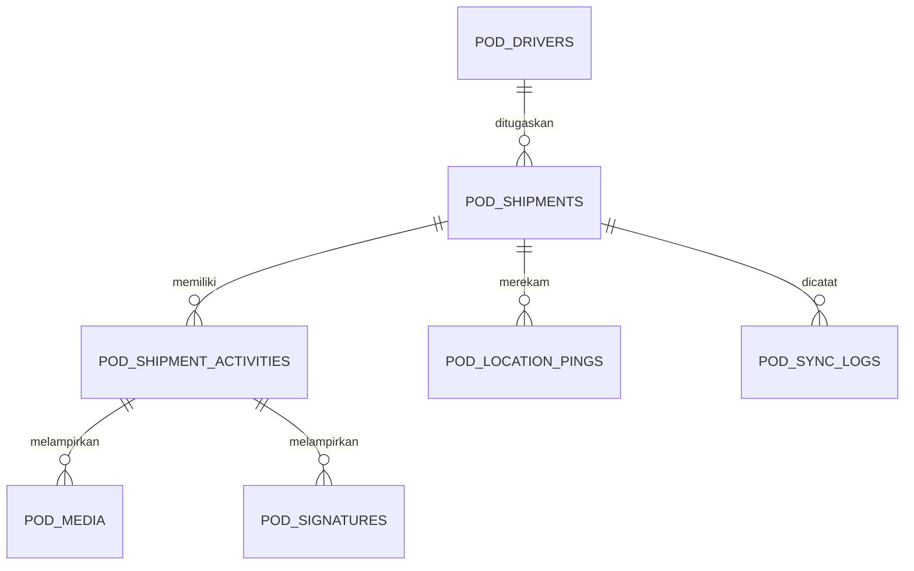
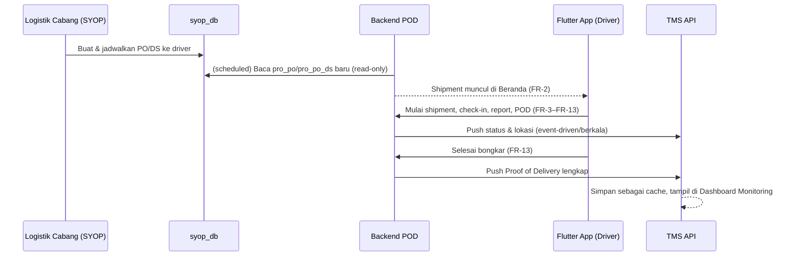

# Architecture Document — POD ProEnergi v1.0

## 1. Pendahuluan

### 1.1 Tujuan Dokumen

Dokumen ini menjabarkan arsitektur teknis aplikasi **POD ProEnergi** sebagai turunan teknis dari [PRD POD ProEnergi v2.0](01-PRD.md). Cakupannya meliputi arsitektur aplikasi mobile (Flutter), backend & database POD sendiri, integrasi read-only ke SYOP native dan integrasi push ke TMS, keamanan, dan deployment — sebagai acuan bagi tim development dalam membangun sistem.

### 1.2 Ruang Lingkup

Arsitektur ini mencakup seluruh modul pada PRD Bagian 7 (FR-1 s.d. FR-18): autentikasi driver, shipment (daftar, mulai, navigasi, check-in, report muat/bongkar, POD, riwayat), profil, serta modul integrasi backend (baca SYOP, push ke TMS, provisioning via TMS). Dokumen ini **tidak** mencakup arsitektur internal TMS atau SYOP native — keduanya sudah didokumentasikan terpisah (lihat [Architecture Document TMS](../02-Architecture.md)); di sini POD diperlakukan sebagai sistem ketiga yang terhubung ke keduanya lewat kontrak integrasi yang didefinisikan di Bagian 6.

### 1.3 Keputusan Teknis yang Menjadi Dasar

- **Mobile app**: Flutter (Android prioritas utama, iOS menyusul) — sesuai PRD Bagian 3.1, satu basis kode untuk kedua platform di masa depan.
- **Backend POD**: Laravel 12 (REST API) — direkomendasikan agar konsisten dengan stack TMS yang sudah berjalan (tim yang sama, pola adapter/queue/scheduler yang sudah terbukti dapat dipakai ulang; lihat catatan pada Bagian 10). **Perlu dikonfirmasi tim tech lead** sebelum development dimulai — bila tim mobile/backend POD berbeda dari tim TMS dan lebih terbiasa dengan stack lain (mis. Node.js/NestJS, Go), keputusan ini dapat direvisi tanpa mengubah prinsip arsitektur pada dokumen ini (adapter, sinkronisasi satu arah, tanpa akses DB langsung dari mobile).
- **Database POD**: MySQL, database (`pod_db`) yang sepenuhnya terpisah dari `tms_db` dan `syop_db` — sesuai keputusan arsitektur PRD Bagian 11 (bukan berbagi instance seperti TMS↔SYOP).
- Integrasi ke SYOP native dan ke TMS **wajib lewat lapisan adapter/API**, tidak ada akses database lintas sistem dari aplikasi mobile (lihat PRD Bagian 11 — ini bukan keputusan baru, melainkan batasan yang sudah difinalkan di PRD dan menjadi dasar seluruh arsitektur di dokumen ini).

## 2. Gambaran Arsitektur

### 2.1 Ringkasan Tech Stack

| Layer | Teknologi | Keterangan |
|---|---|---|
| Mobile App | Flutter 3.x (Dart), state management Riverpod/Bloc | Android prioritas utama; struktur proyek disiapkan agar iOS bisa menyusul tanpa restrukturisasi besar. |
| HTTP Client (mobile) | `dio` + interceptor auth/retry | Menyisipkan token Bearer, retry otomatis untuk request yang gagal karena putus koneksi sementara (NFR-03). |
| Penyimpanan lokal (mobile) | SQLite (`sqflite`) atau Hive | Antrian offline (foto, tanda tangan, update lokasi, perubahan status) sebelum berhasil terkirim ke backend — lihat Bagian 3.2. |
| Kredensial di perangkat | `flutter_secure_storage` | Menyimpan token API POD (bukan kredensial database apa pun) terenkripsi di keystore/keychain OS. |
| Lokasi & Maps | `geolocator`, deep link Google Maps | GPS breadcrumb (FR-4, FR-7 modul tracking) dan navigasi (FR-4). |
| Kamera & Tanda Tangan | `camera` (capture langsung, tanpa galeri — FR-7), `signature`/kanvas custom (FR-8) | Sesuai aturan bisnis FR-7 (tidak boleh pilih dari galeri). |
| Backend POD | Laravel 12 (PHP 8.2+), REST API `/api/v1` | Struktur modular per domain (Bagian 4.1) — pola sama dengan backend TMS. |
| Autentikasi API | Laravel Sanctum (token personal-access, bukan session) | Driver login → terima token, dipakai di setiap request (mirip pola AuthController TMS). |
| Database POD | MySQL 8.x — `pod_db` | Terpisah sepenuhnya dari `tms_db` dan `syop_db` (PRD Bagian 11). |
| Koneksi baca SYOP | MySQL 8.x — `syop_db` (existing), diakses lewat koneksi kedua **read-only** | Hanya dari backend POD (server), tidak pernah dari mobile app. Dibatasi ke tabel `pro_po`/`pro_po_detail`/`pro_po_ds`/`pro_po_ds_detail` (least-privilege). |
| Integrasi ke TMS | HTTP REST API (Sanctum service-to-service token) | Push status/lokasi/POD, baca master driver, terima provisioning (PRD Bagian 11). |
| Queue & Scheduler | Laravel Queue + Scheduler | Sinkronisasi berkala dari SYOP, push berkala/event-driven ke TMS (Bagian 4.5). |
| Penyimpanan Media | Local disk / object storage (S3-compatible) dengan akses terbatas (bukan URL publik) | Foto bukti & tanda tangan (NFR-05, NFR-08). |
| Push Notification (fase lanjutan) | Firebase Cloud Messaging | Lihat PRD Bagian 16 — bukan baseline FR wajib. |
| Web/App Server | Nginx + PHP-FPM | Menjalankan backend POD, pola sama dengan TMS. |
| Observability | Laravel log → log aggregator, uptime/response time monitoring | Lihat Bagian 9.1. |

### 2.2 Diagram Konteks

Gambar 1. Context Diagram — POD ProEnergi terhadap driver, SYOP native, dan TMS.

```mermaid
graph LR
    Driver["Driver\n(Aplikasi Flutter)"]
    LogistikCabang["Logistik Cabang\n(SYOP, di luar cakupan app POD)"]
    ITSistem["IT / Admin Sistem\n(TMS)"]
    LogistikTMS["Tim Logistik / Logistik HO /\nManajemen (TMS, read-only)"]

    PodBackend["Backend POD\n(Laravel 12 + pod_db)"]
    SyopNative["SYOP native\n(syop_db: pro_po/pro_po_detail/\npro_po_ds/pro_po_ds_detail)"]
    TMS["TMS\n(tms_db)"]

    Driver -->|Login, update status shipment,\nfoto, tanda tangan, lokasi GPS| PodBackend
    LogistikCabang -->|Buat & jadwalkan PO/DS| SyopNative
    PodBackend -->|Baca penugasan shipment\n(read-only)| SyopNative
    PodBackend -->|Push status/lokasi/POD| TMS
    ITSistem -->|Provisioning akun POD driver| TMS
    TMS -->|API provisioning & baca status driver| PodBackend
    TMS -->|Dashboard monitoring| LogistikTMS
```

### 2.3 Prinsip Arsitektur

- **Tidak ada koneksi database langsung dari aplikasi mobile** ke sistem manapun (SYOP, TMS, atau bahkan `pod_db` sendiri) — Flutter hanya bicara ke REST API milik backend POD (PRD Bagian 11, ditegaskan ulang sebagai batasan arsitektur wajib, bukan opsi).
- Batas kepemilikan data jelas — POD punya `pod_db` sendiri, sepenuhnya independen dari `tms_db`/`syop_db`.
- Semua akses ke data SYOP dibungkus lapisan adapter (pola sama dengan `SyopDataProvider` di TMS), tidak ada query langsung tersebar di kode bisnis backend POD.
- Semua komunikasi ke TMS dibungkus satu service/lapisan terpusat (`TmsSyncClient`), bukan dipanggil bebas dari banyak controller.
- Sinkronisasi antar sistem bersifat **satu arah eksplisit per jenis data** — baca dari SYOP, tulis ke TMS, tidak ada arah yang membingungkan (lihat matriks Bagian 6.2).
- Antrian offline di perangkat driver adalah warga kelas satu dalam desain (bukan tambahan belakangan) — setiap aksi driver yang mengubah data (check-in, foto, tanda tangan, penyelesaian aktivitas) ditulis dulu ke penyimpanan lokal, baru disinkronkan (NFR-03).

## 3. Arsitektur Mobile App (Flutter)

### 3.1 Struktur Aplikasi

- **State management**: Riverpod (atau Bloc, dipilih tim mobile saat implementasi) — memisahkan state autentikasi, shipment aktif, dan antrian sinkronisasi sebagai provider/bloc terpisah agar mudah diuji.
- **Navigasi layar** mengikuti alur PRD Bagian 6 & 7: Login (FR-1) → Beranda (FR-2) → Detail Shipment/Navigasi (FR-3, FR-4) → Check-in (FR-5, FR-11) → Report (FR-6, FR-9, FR-12) → Media/Tanda Tangan (FR-7, FR-8) → Riwayat (FR-14) → Profil (FR-15).
- **Modul lokal per fitur** (feature-first folder structure): `auth/`, `home/`, `shipment/`, `media/`, `signature/`, `history/`, `profile/`, `sync/` — modul `sync/` berisi seluruh logika antrian offline dan dipakai lintas fitur, bukan ditulis ulang di tiap layar.

### 3.2 Antrian Offline (Offline Queue)

Menjawab NFR-03 (data tidak boleh hilang saat sinyal hilang sementara):

1. Setiap aksi yang mengubah data (check-in, simpan foto, simpan tanda tangan, simpan catatan, selesaikan aktivitas) ditulis **dulu** ke tabel lokal SQLite (`pending_actions`), dengan status `pending`.
2. UI langsung menampilkan hasil aksi secara optimistik (mis. badge foto bertambah) tanpa menunggu response server — pengalaman driver tetap responsif walau sinyal lemah.
3. Background worker (dijalankan tiap beberapa detik atau saat konektivitas berubah — dipantau lewat `connectivity_plus`) memproses `pending_actions` secara berurutan (FIFO per shipment, untuk menjaga urutan waktu aktivitas), mengirim ke backend POD, dan menandai `synced` bila berhasil.
4. Kegagalan kirim (timeout, 5xx) di-retry dengan backoff; kegagalan karena data tidak valid (4xx, mis. shipment sudah ditutup dari sisi lain) ditandai `failed` dan ditampilkan ke driver sebagai notifikasi non-blocking (tidak mengunci UI, tapi driver diberi tahu perlu tindakan, mis. hubungi Tim Logistik).
5. Foto & tanda tangan disimpan sebagai file lokal dulu (path disimpan di `pending_actions`), diunggah sebagai multipart request — upload besar tidak memblokir aksi lain di UI (dijalankan di background isolate).

### 3.3 Tracking Lokasi (GPS)

- Selama shipment berstatus aktif (Berangkat/Dalam Perjalanan — lihat PRD Bagian 6), aplikasi mengambil titik lokasi berkala (interval sesuai NFR-01, mis. 30–60 detik) dan menambahkannya ke `pending_actions` sebagai event `location_ping`, mengikuti alur antrian offline yang sama seperti aksi lain (Bagian 3.2) — bukan jalur terpisah, supaya titik lokasi yang terekam saat sinyal hilang tidak hilang.
- Tracking otomatis berhenti (worker lokasi di-`cancel`) saat shipment berpindah ke status selesai/closed atau belum dimulai (NFR-02), untuk menghemat baterai.

### 3.4 Autentikasi & Sesi

- Login (FR-1) memanggil `POST /api/v1/auth/login` dengan `username` + `pin`; backend mengembalikan token Sanctum yang disimpan di `flutter_secure_storage`.
- Token disertakan sebagai header `Authorization: Bearer <token>` pada seluruh request berikutnya (interceptor `dio`).
- Response 401 dari interceptor memicu logout otomatis dan redirect ke layar Login (sama seperti pola interceptor axios di frontend TMS).

## 4. Arsitektur Backend POD

### 4.1 Struktur Modular Laravel

Mengikuti pola modular yang sama dengan backend TMS (bukan MVC generik satu folder besar):

- `Modules/Auth` — login driver, manajemen token, rate limiting percobaan PIN (FR-1).
- `Modules/Shipment` — status shipment, aktivitas muat/bongkar, check-in (FR-2–FR-6, FR-9–FR-13).
- `Modules/Media` — upload & penyimpanan foto (FR-7) dan tanda tangan (FR-8).
- `Modules/Tracking` — penerimaan & penyimpanan breadcrumb lokasi GPS.
- `Modules/SyopIntegration` — adapter baca data penugasan dari SYOP native (FR-16).
- `Modules/TmsIntegration` — client push data ke TMS, baca master driver, terima provisioning dari TMS (FR-17, FR-18).

### 4.2 API

REST API dengan versioning (`/api/v1`), response terstandarisasi (Laravel API Resource). Dua kelompok endpoint dengan model autentikasi berbeda:

- **Endpoint driver** (dipanggil aplikasi Flutter) — autentikasi Sanctum token per-driver, lingkup akses dibatasi hanya data milik driver yang login (shipment miliknya sendiri, tidak bisa mengakses shipment driver lain).
- **Endpoint service-to-service** (dipanggil TMS, mis. untuk provisioning akun atau baca status) — autentikasi token terpisah khusus server-to-server (bukan token driver), dibatasi lewat IP allowlist/mTLS bila infrastruktur mendukung.

### 4.3 Lapisan Adapter — Baca SYOP (`SyopShipmentProvider`)

Mengikuti pola arsitektur yang identik dengan `SyopDataProvider` di TMS (PRD Bagian 11, Architecture Document TMS Bagian 4.4):

- Interface: `SyopShipmentProviderInterface` — method mis. `getAssignedShipments(int $branchId, ?Carbon $since)`, `getShipmentDetail(string $poDsId)`.
- Implementasi konkret: `SyopShipmentNativeAdapter` — mengakses `syop_db` lewat koneksi database kedua, **read-only**, dibatasi ke tabel `pro_po`, `pro_po_detail`, `pro_po_ds`, `pro_po_ds_detail`.
- Satu-satunya titik akses ke skema SYOP dari seluruh kode backend POD — bila skema `pro_po*` berubah (skenario yang pernah terjadi pada integrasi TMS↔SYOP, lihat PRD Bagian 15), perbaikan cukup dilakukan di adapter ini.
- Dipanggil oleh scheduled job (Bagian 4.5), bukan dipanggil langsung tiap kali driver membuka aplikasi — hasil baca disimpan sebagai cache di `pod_db` (tabel `pod_shipments`, lihat Bagian 5.1) supaya latensi baca SYOP tidak dirasakan langsung oleh driver dan beban ke `syop_db` tetap terkendali (NFR-05).

### 4.4 Lapisan Integrasi — Push & Baca TMS (`TmsSyncClient`)

- Interface: `TmsSyncClientInterface` — method mis. `pushShipmentStatus()`, `pushLocationBatch()`, `pushProofOfDelivery()`, `getDriverStatus(int $driverId)`.
- Implementasi konkret: `TmsApiAdapter` — memanggil REST API TMS lewat HTTPS, autentikasi token service-to-service.
- Endpoint baru yang perlu disediakan **di sisi TMS** (dikerjakan sebagai bagian dari proyek TMS, bukan proyek POD, tapi didefinisikan di sini sebagai kontrak): `POST /api/v1/pod-sync/shipment-status`, `POST /api/v1/pod-sync/locations`, `POST /api/v1/pod-sync/proof-of-delivery`, `GET /api/v1/pod-sync/drivers/{id}/status`, `POST /api/v1/pod-sync/drivers/{id}/provision` (dipanggil TMS → POD, arah kebalikan, lihat Bagian 4.6). Spesifikasi payload rinci disusun di Design Document.

### 4.5 Queue & Scheduler

Job terjadwal (Laravel Scheduler + Queue), mengikuti pola yang sama dengan scheduler TMS↔SYOP:

1. **Sinkronisasi penugasan dari SYOP** (`SyopShipmentProvider`) — berjalan berkala (mis. tiap 5–15 menit, nilai final disepakati di Design Document mempertimbangkan beban ke `syop_db`), mengambil PO/DS baru atau berubah sejak sinkronisasi terakhir, menyimpannya ke `pod_shipments`.
2. **Push status & lokasi ke TMS** — status shipment (mulai, check-in, selesai aktivitas) dipush **segera** (event-driven, saat aksi tersimpan di backend, bukan menunggu jadwal) agar dashboard monitoring TMS terasa "hidup"; breadcrumb lokasi dipush secara **batch berkala** (mis. tiap 1–2 menit) untuk efisiensi, bukan tiap titik satu request.
3. **Push Proof of Delivery** — dipush segera setelah aktivitas (muat/bongkar) selesai (FR-10/FR-13), termasuk metadata foto & tanda tangan (URL/lokasi file, bukan mengirim file mentah berulang ke TMS bila TMS hanya perlu menampilkan ringkasan — keputusan menyimpan file penuh di `pod_db` saja vs. juga mengirim salinan ke TMS didetailkan di Design Document).
4. **Retry job gagal** — job yang gagal (SYOP/TMS tidak dapat dihubungi) di-retry dengan backoff Laravel Queue standar; kegagalan berulang dicatat ke `pod_sync_logs` (PRD Bagian 10) untuk observability (Bagian 9.1).

### 4.6 Provisioning Akun Driver (FR-18)

Sesuai keputusan PRD Bagian 11, arah pemanggilan yang direkomendasikan: **TMS memanggil backend POD** (bukan sebaliknya) saat IT membuat/reset akun lewat panel Master Data Driver di TMS — `POST /pod-api/v1/admin/drivers/{tmsDriverId}/provision` dengan payload `{username, initial_pin}` atau `{action: "reset_pin"}`. Backend POD membuat/memperbarui baris `pod_drivers` (Bagian 5.1) dan mengembalikan konfirmasi ke TMS. Endpoint ini termasuk kelompok service-to-service (Bagian 4.2), tidak pernah dipanggil langsung dari aplikasi Flutter.

## 5. Arsitektur Data

### 5.1 Entitas Utama — Database POD (`pod_db`)

Mengikuti model data ringkas pada PRD Bagian 10:

- `pod_drivers` — referensi ke `drivers.id` TMS + kredensial khusus app (`username`, `pin_hash`, status terkunci/percobaan gagal).
- `pod_shipments` — cache baca dari SYOP (`pro_po`/`pro_po_detail`/`pro_po_ds`/`pro_po_ds_detail`) + kolom status yang dikelola POD (`open`/`on_progress`/`closed`).
- `pod_shipment_activities` — satu baris per aktivitas (muat/bongkar) per shipment: waktu masuk/mulai/selesai/keluar, catatan.
- `pod_media` — foto bukti, relasi ke `pod_shipment_activities`.
- `pod_signatures` — tanda tangan digital, relasi ke `pod_shipment_activities`.
- `pod_location_pings` — breadcrumb lokasi GPS berkala.
- `pod_sync_logs` — jejak audit tiap sinkronisasi ke/dari SYOP dan TMS.
- `pod_pending_actions` *(sisi server, opsional — cermin dari antrian lokal di perangkat untuk audit/debug bila diperlukan; sumber kebenaran antrian tetap di perangkat, lihat Bagian 3.2)*.

### 5.2 Diagram Relasi Data (ERD Ringkas)

Gambar 2. ERD ringkas entitas utama `pod_db`.



Skema lengkap (tipe data, index, kolom penghubung `syop_po_ds_id`/`tms_driver_id`) disusun pada Design Document, setelah struktur tabel `pro_po_ds`/`pro_po_ds_detail` di SYOP diverifikasi bersama tim SYOP.

### 5.3 Hubungan dengan Database SYOP Native dan TMS

`pod_db` **tidak** berbagi instance/skema dengan `syop_db` maupun `tms_db` — berbeda dari pola TMS↔SYOP yang berbagi satu instance MySQL. Backend POD mengonfigurasi:

- Koneksi default (read/write) ke `pod_db`.
- Koneksi kedua (**read-only**, user MySQL terbatas) ke `syop_db`, hanya diakses lewat `SyopShipmentNativeAdapter` (Bagian 4.3).
- **Tidak ada koneksi database langsung ke `tms_db`** — seluruh interaksi dengan TMS lewat HTTP API (`TmsApiAdapter`, Bagian 4.4), karena backend POD kemungkinan besar berada di infrastruktur/server berbeda dari TMS (tidak seperti SYOP yang berbagi instance dengan TMS).

### 5.4 Strategi Sinkronisasi Data

- Data penugasan (shipment) dari SYOP: dibaca berkala, disimpan sebagai cache di `pod_shipments` — tidak pernah ditulis balik ke `syop_db` (read-only, sesuai PRD Bagian 11).
- Data hasil lapangan (status, lokasi, POD): sumber kebenaran ada di `pod_db`, disinkronkan (push) ke TMS sebagai cache monitoring — TMS tidak pernah menulis balik ke `pod_db` (satu arah, sesuai PRD Bagian 11).
- Data master driver: sumber kebenaran tetap `drivers` di TMS; `pod_drivers` hanya menyimpan referensi ID + atribut tambahan khas POD (kredensial), bukan duplikasi penuh (PRD Bagian 10).

## 6. Arsitektur Integrasi

### 6.1 Diagram Komponen

Gambar 3. Component diagram — mobile, backend POD, SYOP, dan TMS.

```mermaid
graph TB
    subgraph Mobile["Aplikasi Flutter (Driver)"]
        UI["UI Layer"]
        SyncQueue["Offline Queue\n(SQLite pending_actions)"]
    end

    subgraph Backend["Backend POD — Laravel 12 (/api/v1)"]
        Auth["Modules/Auth"]
        Shipment["Modules/Shipment"]
        Media["Modules/Media"]
        Tracking["Modules/Tracking"]
        SyopIntegration["Modules/SyopIntegration\n(SyopShipmentProvider)"]
        TmsIntegration["Modules/TmsIntegration\n(TmsSyncClient)"]
        QueueSched["Queue & Scheduler"]
    end

    subgraph Data
        PodDb[("pod_db\nMySQL")]
        SyopDb[("syop_db\nMySQL, read-only\npro_po/pro_po_detail/\npro_po_ds/pro_po_ds_detail")]
    end

    subgraph TmsSystem["TMS"]
        TmsApi["API Sync POD\n(baru)"]
        TmsDb[("tms_db")]
        Dashboard["Dashboard Monitoring\nTim Logistik/Logistik HO/Manajemen"]
    end

    UI --> SyncQueue
    SyncQueue -->|REST API + Bearer token,\nretry otomatis| Backend

    Auth --> PodDb
    Shipment --> PodDb
    Media --> PodDb
    Tracking --> PodDb
    SyopIntegration -->|read-only| SyopDb
    SyopIntegration --> PodDb
    TmsIntegration -->|push status/lokasi/POD,\nbaca status driver| TmsApi
    TmsApi -->|provisioning akun\n(FR-18)| TmsIntegration
    QueueSched --> SyopIntegration
    QueueSched --> TmsIntegration

    TmsApi --> TmsDb --> Dashboard
```

### 6.2 Matriks Integrasi

| Data | Arah | Mekanisme | Frekuensi | Source of Truth |
|---|---|---|---|---|
| Penugasan Shipment (PO/PO Detail/PO DS/PO DS Detail) | SYOP → POD | `SyopShipmentProvider.getAssignedShipments()`, scheduled job → cache `pod_shipments` | Berkala (mis. 5–15 menit) | SYOP |
| Status Shipment Aktif (mulai, check-in, selesai aktivitas) | POD → TMS | `TmsSyncClient.pushShipmentStatus()`, event-driven | Segera setelah aksi tersimpan | POD |
| Lokasi GPS (breadcrumb) | POD → TMS | `TmsSyncClient.pushLocationBatch()`, scheduled job | Berkala, batch (mis. 1–2 menit) | POD |
| Proof of Delivery (foto, tanda tangan, catatan) | POD → TMS | `TmsSyncClient.pushProofOfDelivery()`, event-driven | Segera setelah aktivitas selesai | POD |
| Status Aktif/Nonaktif Driver | TMS → POD | `TmsSyncClient.getDriverStatus()`, dipanggil saat login (FR-2) | Real-time (saat dibutuhkan) | TMS |
| Provisioning Akun POD (username, PIN awal/reset) | TMS → POD | TMS memanggil endpoint admin backend POD (Bagian 4.6) | Event-driven (saat IT melakukan aksi di TMS) | TMS (memicu), POD (menyimpan kredensial) |

Seluruh baris pada tabel ini wajib melalui lapisan adapter/client masing-masing (Bagian 4.3, 4.4) — tidak ada akses database lintas sistem secara langsung, dan **tidak ada satu pun baris yang diakses langsung oleh aplikasi Flutter** (semua lewat backend POD sebagai perantara, sesuai PRD Bagian 11).

### 6.3 Sequence — Siklus Hidup Satu Shipment (Ringkas)

Gambar 4. Sequence diagram ringkas dari penugasan hingga tampil di dashboard TMS.



## 7. Keamanan

### 7.1 Autentikasi

- Login driver (FR-1) memakai `username` + `PIN` (bukan akun TMS/SYOP), token Sanctum untuk sesi API. PIN di-hash (bcrypt/argon2) di `pod_drivers`, tidak pernah disimpan/ditransmisikan sebagai plain text (NFR-04).
- Rate limiting: 5 percobaan PIN salah berturut-turut mengunci akun sementara (FR-1), diterapkan di `Modules/Auth` lewat pola yang sama dengan login rate limiter TMS (`AppServiceProvider`).
- Endpoint service-to-service (Bagian 4.2) memakai token terpisah dari token driver, idealnya dengan IP allowlist antara server POD dan server TMS.

### 7.2 Tidak Ada Akses Database Langsung dari Mobile

Ditegaskan ulang sebagai kontrol keamanan inti (PRD Bagian 11, NFR-04): aplikasi Flutter tidak pernah menyimpan kredensial database SYOP/TMS/POD di dalam kode/APK. Satu-satunya rahasia yang disimpan di perangkat adalah token API POD milik driver yang bersangkutan (`flutter_secure_storage`), dengan cakupan akses terbatas ke data driver itu sendiri.

### 7.3 Akses SYOP — Least Privilege

Koneksi backend POD ke `syop_db` memakai service account MySQL terpisah dengan hak akses **read-only**, dibatasi hanya ke tabel `pro_po`, `pro_po_detail`, `pro_po_ds`, `pro_po_ds_detail` (NFR-05) — tidak diberi akses ke tabel SYOP lain di luar kebutuhan, dan tidak pernah diberi hak tulis.

### 7.4 Proteksi Media & Data Pribadi

- Foto dan tanda tangan disimpan dengan akses terbatas (URL bertanda tangan/signed URL atau di balik autentikasi), bukan URL publik tanpa proteksi (NFR-05).
- Seluruh komunikasi (mobile↔POD, POD↔SYOP, POD↔TMS) memakai HTTPS/TLS.
- Kebijakan retensi foto/tanda tangan (NFR-08) diimplementasikan sebagai scheduled job pembersihan data lama, setelah kebijakan retensi final disepakati dengan pemilik proses.

### 7.5 Audit Trail

Setiap perubahan status shipment dicatat dengan timestamp dan bersifat write-once per tahap (NFR-09) — `pod_shipment_activities` tidak boleh diubah driver setelah aktivitas ditutup; perubahan hanya mungkin lewat proses administratif terpisah (di luar cakupan aplikasi mobile) bila terjadi sengketa.

## 8. Arsitektur Deployment

### 8.1 Diagram Deployment

Gambar 5. Topologi deployment — backend POD sebagai sistem terpisah, terhubung ke SYOP (read-only) dan TMS (API) lewat jaringan.

```mermaid
graph TB
    subgraph Devices["Perangkat Driver"]
        FlutterApp["Aplikasi Flutter\n(Android)"]
    end

    LB["Load Balancer / Reverse Proxy\n(POD)"]

    subgraph PodInfra["Infrastruktur POD (baru, terpisah)"]
        PodApp["Backend POD\n(Nginx + PHP-FPM, Laravel 12)"]
        PodDbSrv[("pod_db\nMySQL")]
    end

    subgraph SyopInfra["Infrastruktur SYOP (existing)"]
        SyopDbSrv[("syop_db\nread-only user\nkhusus POD")]
    end

    subgraph TmsInfra["Infrastruktur TMS (existing)"]
        TmsAppSrv["TMS\n(Nginx + PHP-FPM)"]
        TmsDbSrv[("tms_db")]
    end

    FlutterApp -->|HTTPS| LB --> PodApp
    PodApp -->|read/write| PodDbSrv
    PodApp -->|read-only, jaringan terbatas\n(VPN/firewall rule)| SyopDbSrv
    PodApp <-->|HTTPS REST API| TmsAppSrv
    TmsAppSrv -->|read/write| TmsDbSrv
```

Backend POD **tidak** ditempatkan pada instance MySQL yang sama dengan SYOP/TMS (berbeda dari pola TMS↔SYOP) — kebutuhan jaringan antara server POD dan `syop_db` (akses read-only lintas infrastruktur) perlu dikoordinasikan dengan tim infra/DBA SYOP, misalnya lewat VPN, SSH tunnel, atau firewall rule berbasis IP, sebelum development integrasi dimulai.

### 8.2 Lingkungan

Disiapkan tiga lingkungan: Development, Staging, dan Production, mengikuti pola yang sama dengan TMS. Staging POD disarankan terhubung ke *replika*/salinan `syop_db` dan ke *lingkungan staging* TMS (bukan langsung ke production keduanya), agar pengujian integrasi tidak berisiko terhadap data operasional yang sedang berjalan.

### 8.3 CI/CD

Pipeline build dan deploy otomatis (lint, test, migrasi database `pod_db`, deploy backend, build APK/App Bundle Flutter) dijalankan per lingkungan. Build mobile untuk Play Store/App Store mengikuti proses rilis terpisah dari deploy backend (versi aplikasi mobile dan versi API tidak selalu naik bersamaan — API perlu backward-compatible terhadap versi mobile app yang masih beredar di perangkat driver).

## 9. Observability & Maintenance

### 9.1 Logging & Monitoring

- Log aplikasi backend POD terpusat (Laravel log ke log aggregator), termasuk log khusus tiap sinkronisasi SYOP dan push ke TMS (`pod_sync_logs`, PRD Bagian 10) agar kegagalan integrasi terdeteksi lebih awal (sesuai pengalaman gangguan integrasi SYOP↔TMS sebelumnya).
- Monitoring uptime/response time API POD, serta metrik keberhasilan sinkronisasi (% job sync sukses vs gagal per hari) sebagai indikator kesehatan integrasi.
- Crash reporting mobile (mis. Firebase Crashlytics atau setara) untuk memantau stabilitas aplikasi di perangkat driver yang beragam.

### 9.2 Backup & Disaster Recovery

Backup `pod_db` dijadwalkan independen dari backup `tms_db`/`syop_db`. Mengingat `pod_db` menyimpan bukti hukum pengiriman (foto, tanda tangan — arsip resmi POD, PRD Bagian 7 FR-14), target RPO/RTO untuk `pod_db` dan penyimpanan media perlu disepakati bersama tim infrastruktur, idealnya setara atau lebih ketat dari `tms_db` mengingat sifatnya sebagai bukti hukum.

## 10. Asumsi & Batasan Teknis

- Backend POD direkomendasikan Laravel 12 untuk konsistensi tim dan pola arsitektur (Bagian 1.3) — **keputusan ini terbuka untuk direvisi** oleh tech lead proyek POD tanpa mengubah prinsip inti dokumen ini (mobile tidak pernah akses DB langsung, adapter untuk SYOP, API untuk TMS).
- Backend POD memerlukan akses jaringan read-only ke instance MySQL SYOP native (`syop_db`), meski kemungkinan besar berada di infrastruktur/server berbeda — mekanisme jaringan (VPN/firewall) perlu dikonfirmasi bersama tim infra/DBA SYOP (Bagian 8.1).
- TMS perlu mengembangkan endpoint API baru (`/api/v1/pod-sync/*`, Bagian 4.4) sebagai bagian dari proyek TMS — ini adalah dependency lintas proyek yang perlu direncanakan bersama tim TMS, bukan sesuatu yang bisa diselesaikan sepenuhnya dari sisi POD saja.
- Struktur tabel `pro_po`/`pro_po_detail`/`pro_po_ds`/`pro_po_ds_detail` di SYOP diasumsikan relatif stabil dalam jangka pendek; bila berubah signifikan, hanya `SyopShipmentNativeAdapter` (Bagian 4.3) yang perlu disesuaikan.
- Volume data lokasi GPS dan media (foto/tanda tangan) belum diestimasi secara kuantitatif (jumlah driver aktif × frekuensi shipment × ukuran file) — estimasi kapasitas storage & bandwidth disusun di Design Document setelah asumsi jumlah driver/shipment harian dikonfirmasi pemilik proses.
