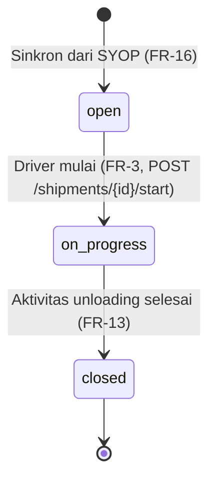
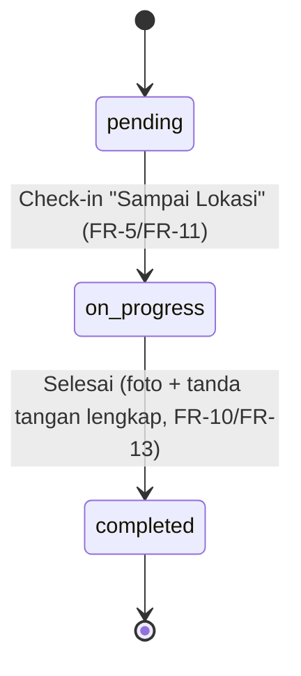
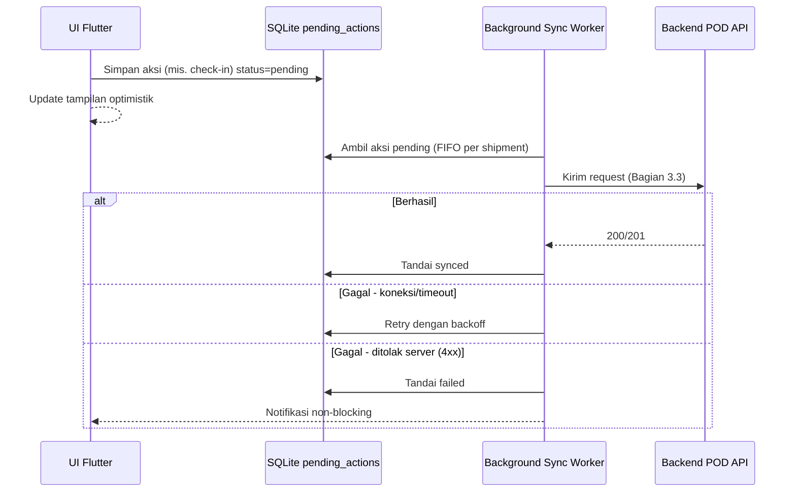
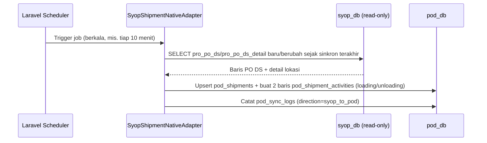
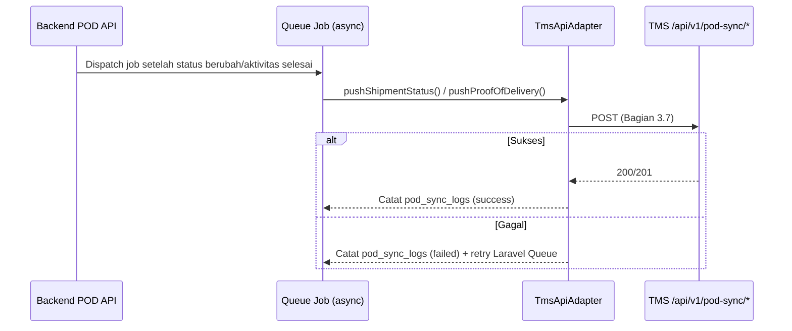

# Design Document — POD ProEnergi v1.0

## 1. Pendahuluan

### 1.1 Tujuan Dokumen

Dokumen ini merinci desain teknis aplikasi POD ProEnergi sebagai turunan dari [Architecture Document POD ProEnergi v1.0](02-Architecture.md) — mencakup desain skema basis data `pod_db`, spesifikasi API (mobile-facing dan service-to-service ke SYOP/TMS), alur proses (flow & state machine), dan prinsip desain antarmuka mobile. Dokumen ini menjadi acuan langsung bagi tim development saat implementasi.

### 1.2 Ruang Lingkup

Cakupan mengikuti modul pada PRD Bagian 7 (FR-1 s.d. FR-18) dan Architecture Document Bagian 4: Autentikasi, Shipment (daftar, mulai, check-in, report, POD, riwayat), Tracking Lokasi, dan Integrasi (baca SYOP, push/tarik TMS, provisioning). Endpoint `/api/v1/pod-sync/*` yang wajib disediakan **di sisi TMS** (Architecture Document Bagian 4.4) didokumentasikan di sini sebagai **kontrak** (payload yang dikirim/diharapkan backend POD) — implementasinya sendiri adalah pekerjaan proyek TMS, bukan proyek POD.

## 2. Desain Basis Data (`pod_db`)

### 2.1 Konvensi Umum

- Primary key: `BIGINT UNSIGNED AUTO_INCREMENT` pada seluruh tabel.
- Setiap tabel memiliki kolom `created_at` dan `updated_at` (timestamps), mengikuti konvensi Laravel.
- Referensi ke sistem lain (`drivers.id` di TMS, `pro_po_ds.id` di SYOP) disimpan sebagai kolom biasa (`tms_driver_id`, `syop_po_ds_id`), **bukan** foreign key database — karena `tms_db` dan `syop_db` berada di server/instance yang berbeda dari `pod_db` (Architecture Document Bagian 5.3), FK lintas server tidak dimungkinkan MySQL. Integritas referensi ini dijaga di level aplikasi (adapter/service), bukan constraint DB.
- Kolom status disimpan sebagai `ENUM` yang konsisten dengan state machine (Bagian 4), bukan angka tanpa makna.
- Tidak memakai soft delete pada tabel transaksional (`pod_shipments`, `pod_shipment_activities`, dst.) — data ini adalah arsip bukti pengiriman (PRD NFR-09 Auditability) dan tidak pernah dihapus dari aplikasi; penghapusan hanya lewat kebijakan retensi terjadwal (NFR-08), bukan aksi pengguna.

### 2.2 DDL — Tabel `pod_drivers`

```sql
CREATE TABLE pod_drivers (
    id                    BIGINT UNSIGNED AUTO_INCREMENT PRIMARY KEY,
    tms_driver_id         BIGINT UNSIGNED NOT NULL,
    username              VARCHAR(50) NOT NULL,
    pin_hash              VARCHAR(255) NOT NULL,
    failed_pin_attempts   TINYINT UNSIGNED NOT NULL DEFAULT 0,
    locked_until          TIMESTAMP NULL,
    is_active             BOOLEAN NOT NULL DEFAULT TRUE,
    last_login_at         TIMESTAMP NULL,
    created_at            TIMESTAMP NULL,
    updated_at            TIMESTAMP NULL,
    UNIQUE KEY uq_pod_drivers_tms_driver_id (tms_driver_id),
    UNIQUE KEY uq_pod_drivers_username (username)
);
```

`tms_driver_id` mengacu ke `drivers.id` di TMS (bukan `syop_driver_id`) — sama seperti `Driver` di PRD Bagian 4, satu driver TMS punya paling banyak satu baris di sini. `is_active` adalah **cache** dari status driver di TMS (disinkron saat provisioning/reset dan saat login, Bagian 3.6), bukan sumber kebenaran — kalau TMS menonaktifkan driver tapi cache ini belum sempat diperbarui, backend POD tetap boleh memvalidasi ulang ke TMS secara real-time saat login (FR-2) sebagai lapisan kedua.

### 2.3 DDL — Tabel `pod_shipments`

```sql
CREATE TABLE pod_shipments (
    id                       BIGINT UNSIGNED AUTO_INCREMENT PRIMARY KEY,
    syop_po_id               VARCHAR(50) NOT NULL,
    syop_po_ds_id            VARCHAR(50) NOT NULL,
    pod_driver_id            BIGINT UNSIGNED NOT NULL,
    shipment_no              VARCHAR(50) NOT NULL,
    customer_name            VARCHAR(150) NOT NULL,
    vehicle_plate_number     VARCHAR(20) NOT NULL,
    shipment_date            DATE NOT NULL,
    loading_location_name    VARCHAR(150) NOT NULL,
    loading_address          TEXT NOT NULL,
    loading_lat              DECIMAL(10,7) NULL,
    loading_lng              DECIMAL(10,7) NULL,
    unloading_location_name  VARCHAR(150) NOT NULL,
    unloading_address        TEXT NOT NULL,
    unloading_lat            DECIMAL(10,7) NULL,
    unloading_lng            DECIMAL(10,7) NULL,
    status                   ENUM('open','on_progress','closed') NOT NULL DEFAULT 'open',
    started_at               TIMESTAMP NULL,
    completed_at             TIMESTAMP NULL,
    synced_from_syop_at      TIMESTAMP NOT NULL,
    pushed_to_tms_at         TIMESTAMP NULL,
    created_at               TIMESTAMP NULL,
    updated_at               TIMESTAMP NULL,
    UNIQUE KEY uq_pod_shipments_syop_po_ds_id (syop_po_ds_id),
    KEY idx_pod_shipments_driver_status (pod_driver_id, status),
    FOREIGN KEY (pod_driver_id) REFERENCES pod_drivers(id) ON DELETE RESTRICT
);
```

`syop_po_ds_id` adalah kunci unik penghubung ke `pro_po_ds` di SYOP (PRD Bagian 4) — satu baris `pod_shipments` = satu penjadwalan pengiriman. Kolom `loading_lat/lng`/`unloading_lat/lng` bersifat nullable karena ketersediaan koordinat presisi di SYOP untuk tiap lokasi customer belum dipastikan (lihat Bagian 8 Asumsi) — bila kosong, fitur geofence check-in (PRD FR-5) dilewati dan navigasi Maps (FR-4) memakai pencarian berbasis alamat teks sebagai fallback.

### 2.4 DDL — Tabel `pod_shipment_activities`

```sql
CREATE TABLE pod_shipment_activities (
    id                    BIGINT UNSIGNED AUTO_INCREMENT PRIMARY KEY,
    pod_shipment_id       BIGINT UNSIGNED NOT NULL,
    activity_type         ENUM('loading','unloading') NOT NULL,
    status                ENUM('pending','on_progress','completed') NOT NULL DEFAULT 'pending',
    arrived_at            TIMESTAMP NULL,
    started_at            TIMESTAMP NULL,
    finished_at           TIMESTAMP NULL,
    departed_at           TIMESTAMP NULL,
    arrival_lat           DECIMAL(10,7) NULL,
    arrival_lng           DECIMAL(10,7) NULL,
    notes                 TEXT NULL,
    created_at            TIMESTAMP NULL,
    updated_at            TIMESTAMP NULL,
    UNIQUE KEY uq_pod_activity_shipment_type (pod_shipment_id, activity_type),
    FOREIGN KEY (pod_shipment_id) REFERENCES pod_shipments(id) ON DELETE CASCADE
);
```

Satu shipment selalu punya tepat dua baris di tabel ini (`loading` dan `unloading`), dibuat otomatis bersamaan saat `pod_shipments` disinkron dari SYOP (Bagian 4.1) — bukan dibuat driver. `arrival_lat/lng` merekam posisi GPS driver saat menekan "Sampai Lokasi" (PRD FR-5), disimpan terpisah dari `pod_location_pings` (breadcrumb berkala) karena punya arti bisnis khusus (bukti kedatangan).

### 2.5 DDL — Tabel `pod_media` dan `pod_signatures`

```sql
CREATE TABLE pod_media (
    id                          BIGINT UNSIGNED AUTO_INCREMENT PRIMARY KEY,
    pod_shipment_activity_id    BIGINT UNSIGNED NOT NULL,
    file_path                   VARCHAR(255) NOT NULL,
    mime_type                   VARCHAR(50) NOT NULL,
    file_size_bytes             INT UNSIGNED NOT NULL,
    taken_at                    TIMESTAMP NOT NULL,
    uploaded_at                 TIMESTAMP NOT NULL,
    created_at                  TIMESTAMP NULL,
    FOREIGN KEY (pod_shipment_activity_id) REFERENCES pod_shipment_activities(id) ON DELETE CASCADE
);

CREATE TABLE pod_signatures (
    id                          BIGINT UNSIGNED AUTO_INCREMENT PRIMARY KEY,
    pod_shipment_activity_id    BIGINT UNSIGNED NOT NULL,
    file_path                   VARCHAR(255) NOT NULL,
    signed_at                   TIMESTAMP NOT NULL,
    created_at                  TIMESTAMP NULL,
    UNIQUE KEY uq_pod_signature_activity (pod_shipment_activity_id),
    FOREIGN KEY (pod_shipment_activity_id) REFERENCES pod_shipment_activities(id) ON DELETE CASCADE
);
```

`pod_media` sengaja tanpa `UNIQUE` (PRD FR-7 mengizinkan lebih dari satu foto per aktivitas); `pod_signatures` diberi `UNIQUE` per aktivitas (PRD FR-8: satu tanda tangan final per aktivitas, perubahan harus lewat "Atur Ulang" eksplisit yang menimpa baris ini, bukan menambah baris baru).

### 2.6 DDL — Tabel `pod_location_pings` dan `pod_sync_logs`

```sql
CREATE TABLE pod_location_pings (
    id                  BIGINT UNSIGNED AUTO_INCREMENT PRIMARY KEY,
    pod_shipment_id     BIGINT UNSIGNED NOT NULL,
    pod_driver_id       BIGINT UNSIGNED NOT NULL,
    lat                 DECIMAL(10,7) NOT NULL,
    lng                 DECIMAL(10,7) NOT NULL,
    recorded_at         TIMESTAMP NOT NULL COMMENT 'waktu di perangkat driver',
    received_at         TIMESTAMP NOT NULL COMMENT 'waktu server menerima',
    pushed_to_tms_at    TIMESTAMP NULL,
    created_at          TIMESTAMP NULL,
    KEY idx_pod_location_shipment_time (pod_shipment_id, recorded_at),
    FOREIGN KEY (pod_shipment_id) REFERENCES pod_shipments(id) ON DELETE CASCADE,
    FOREIGN KEY (pod_driver_id) REFERENCES pod_drivers(id) ON DELETE RESTRICT
);

CREATE TABLE pod_sync_logs (
    id               BIGINT UNSIGNED AUTO_INCREMENT PRIMARY KEY,
    direction        ENUM('syop_to_pod','pod_to_tms','tms_to_pod') NOT NULL,
    sync_type        VARCHAR(50) NOT NULL COMMENT 'mis. shipment_assignment, shipment_status, location_batch, proof_of_delivery, driver_status, provisioning',
    status           ENUM('success','failed') NOT NULL,
    record_count     INT UNSIGNED NOT NULL DEFAULT 0,
    error_message    TEXT NULL,
    started_at       TIMESTAMP NOT NULL,
    finished_at      TIMESTAMP NULL,
    created_at       TIMESTAMP NULL
);
```

`recorded_at` vs `received_at` pada `pod_location_pings` sengaja dipisah — beda waktu keduanya dipakai untuk mendeteksi keterlambatan sinkronisasi akibat sinyal buruk (relevan untuk metrik keberhasilan PRD Bagian 11: "rata-rata keterlambatan update lokasi").

## 3. Desain API

### 3.1 Konvensi Umum

- Base URL mobile-facing: `/api/v1`. Base URL service-to-service (dipanggil TMS): `/api/v1/admin` — dipisah prefix supaya middleware autentikasinya berbeda (Bagian 3.6) dan mudah dibatasi di reverse proxy/firewall (Architecture Document Bagian 8.1).
- Autentikasi mobile: `Authorization: Bearer <token driver>` (Sanctum).
- Autentikasi service-to-service: `Authorization: Bearer <token service TMS>` (Sanctum token terpisah, scope admin).
- Format response sukses: `{ "data": ... }`. Format response error: `{ "message": ..., "errors": {...} }` dengan HTTP status standar (400, 401, 403, 404, 409, 422, 500) — konsisten dengan konvensi TMS.
- Upload foto/tanda tangan: `multipart/form-data`.
- Semua endpoint yang mengubah data shipment memvalidasi `pod_shipment.pod_driver_id` sama dengan driver yang sedang login (403 bila tidak) — driver tidak bisa mengubah shipment driver lain meski tahu ID-nya.

### 3.2 Endpoint — Autentikasi (FR-1)

| Method | Endpoint | Deskripsi |
|---|---|---|
| POST | `/auth/login` | Body `{username, pin}`. Balas `{data: {token, driver: {id, name, plate_number}}}`. 401 kredensial salah (pesan generik, tidak membedakan username/PIN salah — PRD FR-1). 423 bila akun terkunci (`locked_until` belum lewat). |
| POST | `/auth/logout` | Mencabut token yang sedang dipakai. |

**Rate limiting**: 5 percobaan gagal berturut-turut men-set `locked_until = now() + 15 menit` dan `failed_pin_attempts` di-reset ke 0 setelah lock berakhir atau setelah login berhasil.

### 3.3 Endpoint — Shipment (FR-2 s.d. FR-13)

| Method | Endpoint | Deskripsi |
|---|---|---|
| GET | `/shipments` | Daftar shipment milik driver login, terurut tanggal (FR-2). Filter implisit: hanya `status != closed` (shipment closed ada di `/shipments/history`). |
| GET | `/shipments/{id}` | Detail satu shipment + kedua aktivitasnya (FR-2, FR-4). |
| POST | `/shipments/{id}/start` | Mulai shipment (FR-3). 409 bila driver sudah punya shipment lain berstatus `on_progress` (aturan "satu driver satu trip aktif", PRD Bagian 9/14). |
| POST | `/shipments/{id}/activities/{type}/check-in` | `{type}` = `loading`\|`unloading`. Body opsional `{lat, lng}` untuk geofence (FR-5/FR-11). Mengisi `arrived_at`, `started_at`. 422 bila aktivitas sebelumnya belum selesai (mis. check-in `unloading` sebelum `loading` selesai). |
| PATCH | `/shipments/{id}/activities/{type}/notes` | Body `{notes}` — simpan catatan inline (FR-9), bisa dipanggil berkali-kali (autosave). |
| POST | `/shipments/{id}/activities/{type}/media` | Multipart, field `photo`. Simpan satu foto baru (FR-7). Balas metadata foto + total jumlah foto pada aktivitas ini (untuk badge FR-6). |
| DELETE | `/shipments/{id}/activities/{type}/media/{mediaId}` | Hapus foto sebelum aktivitas diselesaikan (FR-7, opsi hapus di galeri). |
| PUT | `/shipments/{id}/activities/{type}/signature` | Multipart, field `signature`. Timpa tanda tangan (final per aktivitas — FR-8, "Atur Ulang" memanggil ulang endpoint ini). |
| POST | `/shipments/{id}/activities/{type}/complete` | Selesaikan aktivitas (FR-10/FR-13). 422 bila belum ada minimal 1 foto & 1 tanda tangan. Mengisi `finished_at`, `departed_at`. Bila `type=unloading`, sekaligus menutup `pod_shipments.status = closed` dan `completed_at`. |

### 3.4 Endpoint — Riwayat & Profil (FR-14, FR-15)

| Method | Endpoint | Deskripsi |
|---|---|---|
| GET | `/shipments/history` | Daftar shipment `status = closed` milik driver login, terbaru dulu (FR-14). |
| GET | `/shipments/history/{id}` | Detail lengkap shipment selesai (read-only), termasuk seluruh foto & tanda tangan (FR-14). |
| GET | `/profile` | Data driver login: nama, plat nomor kendaraan yang ditugaskan (FR-15). |

### 3.5 Endpoint — Tracking Lokasi

| Method | Endpoint | Deskripsi |
|---|---|---|
| POST | `/tracking/locations` | Body `{shipment_id, points: [{lat, lng, recorded_at}, ...]}` — batch upload dari antrian offline (Architecture Document Bagian 3.2/3.3), bukan satu titik per request, untuk efisiensi jaringan. Ditolak (422) bila `shipment_id` bukan milik driver login atau shipment tidak berstatus `on_progress`. |

### 3.6 Endpoint — Service-to-Service (dipanggil TMS, FR-18)

| Method | Endpoint | Deskripsi |
|---|---|---|
| POST | `/admin/drivers/{tmsDriverId}/provision` | Body `{username, initial_pin}`. Buat baris `pod_drivers` baru (409 bila `tms_driver_id` atau `username` sudah ada). Dipanggil TMS saat IT membuat akun POD dari panel Master Data Driver. |
| POST | `/admin/drivers/{tmsDriverId}/reset-pin` | Body `{new_pin}`. Reset PIN + `failed_pin_attempts = 0`, `locked_until = null`. |
| PATCH | `/admin/drivers/{tmsDriverId}/status` | Body `{is_active}`. Update cache status aktif (Bagian 2.2) saat driver dinonaktifkan/diaktifkan di TMS. |

Ketiga endpoint di atas mencatat baris ke `pod_sync_logs` (`direction = tms_to_pod`) untuk audit siapa memicu perubahan kredensial kapan.

### 3.7 Kontrak Endpoint di Sisi TMS (`/api/v1/pod-sync/*`)

Endpoint berikut **bukan** bagian dari backend POD — ini adalah kontrak yang perlu disediakan tim TMS (Architecture Document Bagian 4.4), didokumentasikan di sini agar kedua tim development bisa mengimplementasikan sisi masing-masing secara independen tanpa menunggu satu sama lain.

| Method | Endpoint (di TMS) | Dipanggil oleh | Payload |
|---|---|---|---|
| POST | `/api/v1/pod-sync/shipment-status` | Backend POD, event-driven | `{syop_po_ds_id, tms_driver_id, status, started_at, completed_at}` |
| POST | `/api/v1/pod-sync/locations` | Backend POD, berkala (batch) | `{syop_po_ds_id, tms_driver_id, points: [{lat, lng, recorded_at}, ...]}` |
| POST | `/api/v1/pod-sync/proof-of-delivery` | Backend POD, saat aktivitas selesai | `{syop_po_ds_id, activity_type, finished_at, notes, photo_urls: [...], signature_url}` |
| GET | `/api/v1/pod-sync/drivers/{tmsDriverId}/status` | Backend POD, saat login (FR-2) | Balas `{is_active}` |

TMS menyimpan hasil `shipment-status`/`locations`/`proof-of-delivery` sebagai cache untuk Dashboard Monitoring (PRD Bagian 3.1) — desain tabel cache di sisi `tms_db` (mis. `pod_shipment_cache`, `pod_location_cache`) adalah bagian dari Design Document TMS, bukan dokumen ini.

### 3.8 Contoh Payload — Login

Request: `POST /api/v1/auth/login`

```json
{
  "username": "sopir.jkt01",
  "pin": "482913"
}
```

Response `200`:

```json
{
  "data": {
    "token": "1|abcdef123456...",
    "driver": {
      "id": 42,
      "name": "Budi Santoso",
      "plate_number": "B 9012 XYZ"
    }
  }
}
```

Response `401` (kredensial salah, pesan generik sesuai FR-1):

```json
{
  "message": "Username atau PIN salah."
}
```

### 3.9 Contoh Payload — Selesaikan Aktivitas Muat

Request: `POST /api/v1/shipments/501/activities/loading/complete`

Response `200`:

```json
{
  "data": {
    "shipment_id": 501,
    "activity_type": "loading",
    "status": "completed",
    "finished_at": "2026-09-10T08:45:00+07:00",
    "departed_at": "2026-09-10T08:45:00+07:00",
    "next_activity": "unloading"
  }
}
```

Response `422` (belum lengkap):

```json
{
  "message": "Aktivitas belum bisa diselesaikan.",
  "errors": {
    "signature": ["Tanda tangan belum diisi."]
  }
}
```

## 4. Desain Alur Proses

### 4.1 State Machine — Status Shipment

Gambar 1. State machine `pod_shipments.status`.



### 4.2 State Machine — Status Aktivitas (per Muat/Bongkar)

Gambar 2. State machine `pod_shipment_activities.status`, berlaku identik untuk `loading` dan `unloading`.



Transisi `pending → on_progress` untuk aktivitas `unloading` hanya diperbolehkan setelah aktivitas `loading` berstatus `completed` (divalidasi di endpoint check-in, Bagian 3.3) — mencerminkan alur dua titik pada PRD Bagian 6.

### 4.3 Alur Antrian Offline & Sinkronisasi (Mobile → Backend)

Gambar 3. Sequence pengiriman satu aksi driver lewat antrian offline (Architecture Document Bagian 3.2).



### 4.4 Alur Sinkronisasi Penugasan dari SYOP (FR-16)

Gambar 4. Sequence job terjadwal baca SYOP.



### 4.5 Alur Push ke TMS (FR-17)

Gambar 5. Sequence push status & POD ke TMS — event-driven untuk status/POD, batch berkala untuk lokasi (Architecture Document Bagian 4.5).



## 5. Desain Antarmuka Mobile

### 5.1 Prinsip Desain

Mengikuti PRD Bagian 9: tema Biru & Oranye, informasi kritis selalu terlihat tanpa navigasi tambahan, aksi penting memakai pola slide-to-confirm, catatan selalu inline (bukan pop-up). Wireframe visual (mockup high-fidelity per layar) belum dibuat pada dokumen ini — disusun terpisah oleh tim desain/mobile sebagai lanjutan, memakai FR-1 s.d. FR-15 (PRD Bagian 7) sebagai spesifikasi elemen & field per layar.

### 5.2 Daftar Layar

| Layar | FR Terkait | Endpoint Utama |
|---|---|---|
| Login | FR-1 | `POST /auth/login` |
| Beranda | FR-2 | `GET /shipments` |
| Detail Shipment / Navigasi | FR-3, FR-4 | `GET /shipments/{id}`, `POST /shipments/{id}/start` |
| Check-in Lokasi | FR-5, FR-11 | `POST /shipments/{id}/activities/{type}/check-in` |
| Report Aktivitas | FR-6, FR-9, FR-12 | `GET /shipments/{id}`, `PATCH .../notes` |
| Media (Foto) | FR-7 | `POST`/`DELETE .../media` |
| Tanda Tangan | FR-8 | `PUT .../signature` |
| Selesai Aktivitas | FR-10, FR-13 | `POST .../complete` |
| Riwayat | FR-14 | `GET /shipments/history` |
| Profil | FR-15 | `GET /profile`, `POST /auth/logout` |

## 6. Desain Keamanan Teknis Tambahan

- Validasi input pada seluruh endpoint (Form Request Laravel bila backend memakai Laravel — Architecture Document Bagian 1.3).
- Rate limiting pada `/auth/login` (Bagian 3.2) dan pada seluruh endpoint publik lain untuk mencegah penyalahgunaan.
- Endpoint shipment memvalidasi ulang kepemilikan (`pod_driver_id`) di backend, tidak mengandalkan validasi frontend (Bagian 3.1).
- Query ke `syop_db` dibatasi hanya lewat `SyopShipmentNativeAdapter` dengan user MySQL read-only (Architecture Document Bagian 4.3 & 7.3).
- File foto/tanda tangan disimpan di path yang tidak bisa ditebak (mis. UUID, bukan ID berurutan) dan diakses lewat endpoint yang memvalidasi token, bukan URL statis publik (NFR-05).

## 7. Asumsi Teknis yang Perlu Diverifikasi

- Ketersediaan kolom koordinat (lat/lng) presisi untuk lokasi muat/bongkar di `pro_po_ds_detail` — bila tidak tersedia, geofence check-in (FR-5/FR-11) dan sebagian akurasi navigasi (FR-4) memakai fallback berbasis alamat teks (lihat Bagian 2.3).
- Format/tipe data persis kolom `pro_po`, `pro_po_detail`, `pro_po_ds`, `pro_po_ds_detail` di SYOP belum diverifikasi terhadap skema produksi — DDL `pod_shipments` (Bagian 2.3) memakai asumsi nama field yang wajar (nomor shipment, nama customer, plat nomor, alamat) dan **perlu dicocokkan ke `DESCRIBE` tabel sesungguhnya** sebelum implementasi `SyopShipmentNativeAdapter` dimulai — mengikuti pelajaran dari integrasi TMS↔SYOP sebelumnya (PRD Bagian 15) di mana asumsi skema tanpa verifikasi langsung menyebabkan bug produksi.
- Interval sinkronisasi final (SYOP→POD, POD→TMS lokasi) pada Bagian 4.4/4.5 memakai nilai indikatif (10 menit, batch 1–2 menit) — perlu disesuaikan berdasarkan beban aktual `syop_db` dan jumlah driver aktif setelah UAT.
